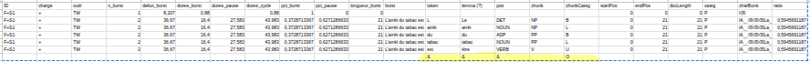
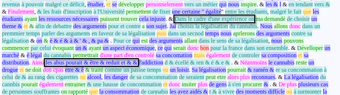
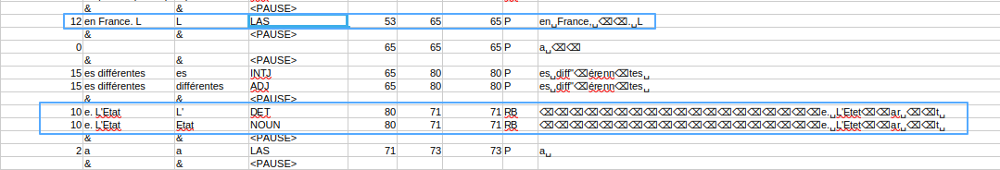
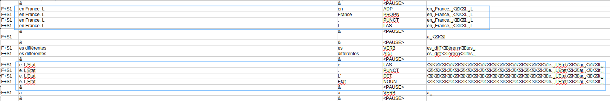

# Journal du stage
> Stage Clesthia sous la tutelle de Mme Cislaru et Mme Eshkol-Taravella
>
> Date : 13/05/2026 - 13/07/2026 

## Réunion - 1 (13/05)

* Réunion : mise en place et orientation du projet
    - explication des données à traiter

## Données (15/05)

* Reprise des anciennes données du projet (ce que les anciens stagiaires ont fait)
* Début d'une démarche

## Test et reproduction (19/05)
### Tokenisation, lemmatisation, postagging
* Tester différents modules : `stanza`, `spacy`
    |           | Stanza    | spaCy |
    | --        | --        | --    |
    | “du”      | ADP + DET | ADP   |
    | “space”   | skip      | SPACE |
    | emp	    | X	        | NUM   |
    | êcheur	| VERB	    | VERB  |
    | égalemn	| ADV	    | ADJ   |
    | ent	    | ADV	    | ADV   |
    | e	        | ADP	    | NOUN  |

* Utilisation de nltk et treetagger pour la tokenisation
$\rightarrow$ impossible de télécharger le corpus français dans la base de données de treetagger.

### Chunking
* `stanza` : *constituency* ne supporte pas le français ❌
* `nltk` : doit construire manuellement les règles
* `spacy` + `benepar` : *benepar* ne supporte pas le français

#### Autres proppositions 
* `stanza` : *depparse* $\rightarrow$ reconstruction avec les syntaxes de dépendance
* `spacy` : *noun_chunks* (chunking seulement pour les NP)
* reprendre [SEM](https://github.com/YoannDupont/SEM) de Yoann Dupont

### Problèmes dans les données

* Les résultats finaux de PAD (`PAD/data/fichier_json`) sont en partie désordonnées
    |	            |	| Corpus A	                        | Corpus B                          |
    | ------------- | - | --------------------------------  | --------------------------------  |
    |Formulation	| +	| arrêt tabac…	                    | **cadre médecine traditionnelle** |
    |	            | -	| législation France…	            | **cadre médecine traditionnelle** |
    |Plannification	| +	| **cadre médecine traditionnelle**	| **cadre médecine traditionnelle** |
    |	            | -	| Nous venons app…	                | Nous venons app…                  |
    |Révision	    | +	| Pour diminuer	                    | Pour diminuer                     |
    |	            | -	| Question législation	            | Question législation              |

    Corpus A = burst | Corpus B = chunk
    $\rightarrow$ Le problème ne vient pas des scripts mais des fichiers d'entrée $\Rightarrow$ les fichiers ont été confondu

## SEM (20/05)

### `filesFromFolder` 
Permet d'extraire les fichiers d'un dossier. La fonction rend un dictionnaire avec pour clé l'extension et la valeur une liste des chemins des fichiers

### `csv2txt`
Fonction de prétraitement avant l'utilisation de SEM. Il transforme les données **burst** du csv ou excel en texte brut

### SEM
Problèmes rencontrés lors de l'installation et l'utilisation
* Il ne marche qu'avec un **python <= python=3.8**
* python ne supporte plus `cgi`, il faut changer en `html` et l'importer dans le fichier *html.py*
    $\rightarrow$ cette manipulation est obligatoire si et seulement si nous voulons une sortie en html

Commandes utilisées :
-
Ces commandes doiven être faites dans le dossier SEM
```bash
# Après création de l'environnement : python=3.8
rm -rf build dist *.egg-info sem_data
python -m pip install setuptools wheel
python -m ensurepip --upgrade
python -m pip install --upgrade pip setuptools wheel
python setup.py install
sem --help # vérifier si SEM marche bien

# Run SEM in SEM repo
sem tagger resources/master/fr/chunking.xml ../Align_BC/data/txt/revision-.txt -o ../Align_BC/data/html/ -f html
sem tagger resources/master/fr/chunking.xml ../Align_BC/data/txt/formulation-.txt -o ../Align_BC/data/html/ -f html
sem tagger resources/master/fr/chunking.xml ../Align_BC/data/txt/planification-.txt -o ../Align_BC/data/html/ -f html
```

## Réunion - 2 (21/05)
* Fichier de sortie : peut réunir tout, il faut juste qu'on puisse faire les comparaisons par la suite (ajout d'un filtrage si nous réunissons tout)
* Garder toutes les colonnes du corpus d'origine et ajouter les traitements (chunk et pos) $\rightarrow$ ranger par token donc doublé les autres informations déjà présentes

### Résultat attendu (CSV et JSON)
#### CSV

* ajout d'une ligne vide avec le symbole **&** pour montrer une pause
* les lignes "vides" (comportant des espaces ou suppression) sont gardé car ils ont des données implicites que nous retrouvons dans *charBurst*

#### JSON
```json
{ id_0 : {
			information : { "ID" : "F+S1",
                            "input_corpus" : "Formulation",
                            "charge" : "+",
                            "outil" : "TW",
                            "n_burst" : int,
                            ... }
			burst : "L'arrêt du tabac est",
			token : ["l", "arrêt", "du", "tabac", "est"],
			lem : [...], # peut être ignoré
			POS : [("l", DET), ()], # POS précis
			Pause : 0/1, #int
			Bust_categ : "", #str
			Chunk : [("L'arrêt", BL, NP),()] # sous forme de liste 

...}
```
* Dans les chunk, réunir les informations sur chunk et chunkCateg du csv pour avoir les informations du **O** pour les pauses ou les lignes vides
* On peut ajouter les données des autres colonnes

<div style="border:5px solid powderblue; ">
<span style="padding:1px; color:red; background-color:lightgrey; margin:5px"><b>Note :</b></span><br>
<div style="margin-left:15px">
B - 'beggining' 
I - 'inside' <br>
L - 'last' <br>
O - 'outside' <br>
U - 'unit' <br>
----------------- <br>
NP - 'nominal' <br>
VP - 'verbal' <br>
PP - 'preposition' <br>
GADJ - 'adjectif' <br>
GADV - 'adverbe' <br>
CONJC - 'conjonction' <br>
</div>
</div>

### Choix des modules de chunking et postagging
* SEM a un problème dans le chunking : certaines segmentations sont erronées, dans un chunk, nous retrouvons deux chunks

* Choix du module de chunking : NLTK
    - Les chunks étant erronés, et ne connaissant pas d'autres modules de chunking performants pour le français, nous avons décidé de construire manuellement un chunker via le module `nltk`, où le chunker marche avec les règles que nous donnons.
* Choix du module de postagging :
    |           | Stanza    | spaCy | Description |
    | --        | --        | --    | --          |
    | “du”      | ADP + DET | ADP   | stanza divide en "de+le" |
    | “space”   | skip      | SPACE | ignoré par stanza |
    | emp	    | X	        | NUM   | token du burst 1 : stanza reconnaît pour unknow, alors que spacy = number
    | êcher	| VERB	    | VERB  | token du burst 2 $\Rightarrow$ *empêcher* |
    | égalemn	| ADV	    | ADJ   | token du burst 1 : stanza = ADV ☑️ |alors que spacy = ADJ ❌ |
    | ent	    | ADV	    | ADV   | token du burst 2 $\Rightarrow$ *également* |
    | e	        | ADP	    | NOUN  | souvent une révision : oublie des terminaison (e/s/es...) |

    - Après un test rapide entre `stanza` et `spacy`, nous pouvons voir que `stanza` est plus performant et pour la plupart des tokens, plus adapté pour notre corpus et le français. Ainsi, nous avons choisi de prendre le module `stanza` pour l'étiquetages de nos tokens.

#### Amélioration
* *emp* + *êcher* que `stanza` étiquète **X+VERB** $\rightarrow$ changer par **VERB-1** et **VERB-2** pour avoir la liaison entre les deux.
    - La segmentation est ainsi car ce sont deux burst différents, **Hypothèse 1** : une pause ici pour trouver la touche avec le **^** sur le clavier ? $\rightarrow$ vérifier l'hypothèse avec la durée de pause
* *du* : garder l'étiquetage de spaCy qui semble être plus adapté pour notre cas, car l'automatisation est plus simple à faire et ainsi, nous avons qu'une seule ligne pour *du* et non *de+la* (sortie de `stanza`)
    - il faut donc regrouper tous les dispatch de `stanza` et changer l'étiquette en ADP $\Rightarrow$ *du* = **ADP**
* Créer un ou deux autres tags pour les burst qui *e*, *es*, *s*, *ees* qui sont souvents des oublies ou des corrections d'erreurs de terminaison du genre ou du nombre. Souvent présent pour les NC ou ADJ
* Ignorer les espaces dans le postagging, mais garder le vide dans la sortie finale

### Améliorations globales
* Ajouter un filtrage des données pour une meilleur comparaison des données par la suite (facilite l'analyse)
* Ajouter une catégories de POS et de chunk pour les ponctuations et préciser si c'est une ponctuation forte ou faible.
    - `punct_forte = [",", ";", ":"]`
    - `punct_faible = [".", "!", "?"]`

### Ouverture
* Pour le postagging, nous pouvons détailler (genre, nombre...), ce sont des données qui permettent une analyse plus fine et de répondre à des hypothèses avec plus de précision.
* Prendre en compte l'entourage de *du* pour avoir des POS adaptés aux différentes situation (différencier ADP+DET et DET)
* `stanza` saute toutes les espaces, or certains espaces comprtent des données cachées qui ne sont pas explicités dans les *burst* (ce dont nos analyses portent dans ce projet), mais dans les *burstChar*. Ainsi, trouver un moyen de prendre en compte ces données implicites pour avoir plus de données d'analyse.

## Rédaction du journal et postagging avec stanza (22/05)
* Mise au propre du journal de bord et rédaction des décisions prises lors de la réunion 2. 
    - Ajout des quelques détails pour une meilleur compréhension du journal pour les camarades suivants.
* Finaliser le script de postagging avec `stanza` en ajoutant les modifications mentionnées lors de la réunion 2.

## Postagging avec stanza - 2 (26/05)
- Vérification des tests à ajouté pour un POS plus précis et adapté au corpus.
- LAS (selon la diapo *Analyse des données d’écriture en temps réel* — Amandine Jouvenel) voir diapo p. 27-48.
- Utilisation de `explode` dans pandas : range chaque élément de la liste en un élément par ligne tout en répliquant les données des autres colonnes

Problème :
- sur Linux, le GPU n’est pas activé, il faut installer la carte NVIDIA et redémarrer l’ordinateur

## Postagging avec stanza - 3 (27/05)
* Définir les tokens à tagger LAS 
* Détaillé le tag pour les ponctuations 
    * punct_fort = [".", "!", "?"]
    * punct_faible = [",", ";", ":"]

## Postagging avec stanza - 4 (28/05)
- Correction automatique pour les pos=X, si en collant le text A et le text B (A token mtn, B token suivant), leur POS est le même que le pos du B, alors on ajoute une liaison avec `pos_A=POS_1` et `pos_B=POS_2`
- Après un premier test de la fonction `tok_stanza_for_df`, nous remarquons que le script prend plus de 2 minutes à traiter tous les documents, ainsi nous ajoutons une barre de progression avec le module `tqdm` au lieu de faire des plein de `print()` de progression.
- Réorganisation des colonnes, dans les premiers tests, les nouvelles colonnes (token et pos) se trouve en toute fin, alors que nous les voulons juste après la colonne burst.

## Correction des résultats de postagging (29/05)

### Manuel d'utilisation (`df2csv`, `postagging_for_df`)
- `df2csv` : Fonction de conversion DataFrame → csv/excel
    - `corpus` : `pd.DataFrame` qui peut être crée avec `read_corpus`, `tok_stanza_for_df` et `chunking`.
    - `path` : Fichier de sortie
    - `column` : Affiche que les colonnes sélectionnées. Par défaut, toutes les colonnes
    - `format` : Format de sortie, CSV ou Excel. Par défaut CSV.
- `postagging_for_df` : postagging des bursts avec stanza
    - `dataframe` : `pd.DataFrame` venant de `read_corpus`
    - `new_column` : le nom des deux nouvelles colonnes. Par défaut : token et pos

### Corrections
- Correction de *a* tagger en LAS, alors que c’est un VERB
    - comme *a* est en lui-même un burst, stanza ne le reconnaît pas → ajout d’un test pour corriger ce problème
- Correction de l’emplacement des variables `tok` et `postagging` pour pouvoir accumuler toutes les phrases d’un burst
    
    * Ce qui est encadré en bleu sont les erreurs à corriger
    
- Le tag des ponctuations n’a pas été corrigé, l’imbracation des tests n’est pas bien fait
- INTJ : l.34 “équent” n’est pas une interjection

### Test à effectuer
- [ ]  `df2csv()`
    - [ ]  avec une sortie en excel
    - [ ]  avec `column` sélectionné
- [ ]  Vérifier dans la sortie si pour *du* le pos a bien changé et que le token n’a pas été divisé en deux ou que le deuxième token ne soit présent

### A faire
- [x]  Finaliser le script de postagging avec `stanza` en ajoutant les modifications mentionnées lors de la réunion 2. **(29/05)**
- [ ]  Préparer les règles pour débuter le chunk avec nltk
- [x]  Pour le test du POS=X, ajouter la transformation du pos suivant aussi → ex: VERB_2 **(28/05)**
- [ ]  Vérifier la sortie de la fonction `df2csv`
    - [x]  df **(29/05)**
    - [ ]  dict → réécrire une fonction pour la conversion : prendre en compte, les token → list[token], pos = list[tuple(token, pos)] , chunk → list[ tuple(chunk, etiquette, syntaxique)]
- [ ]  Write2Json : passer par la fonction df2dict pour avoir la sortie json comme voulu et non pas identique au csv → trop redondant, avec des doublons inutils
- [ ]  Faire une fonction de filtre ⇒ choisir les pos ou token (chunk ?)