# Journal du stage
> Stage Clesthia sous la tutelle de Mme Cislaru et Mme Eshkol-Taravella
>
> Date : 13/05/2026 - 13/07/2026 

## Réunion - 1 (13/05)

* Réunion : mise en place et orientation du projet
    - explication des données à traiter

## Données (15/05)

* Reprise des anciennes données du projet (ce que les anciens stagiaires ont fait)
* Début d'une démarche

## Test et reproduction (19/05)
### Tokenisation, lemmatisation, postagging
* Tester différents modules : `stanza`, `spacy`
    |           | Stanza    | spaCy |
    | --        | --        | --    |
    | “du”      | ADP + DET | ADP   |
    | “space”   | skip      | SPACE |
    | emp	    | X	        | NUM   |
    | êcheur	| VERB	    | VERB  |
    | égalemn	| ADV	    | ADJ   |
    | ent	    | ADV	    | ADV   |
    | e	        | ADP	    | NOUN  |

* Utilisation de nltk et treetagger pour la tokenisation
$\rightarrow$ impossible de télécharger le corpus français dans la base de données de treetagger.

### Chunking
* `stanza` : *constituency* ne supporte pas le français ❌
* `nltk` : doit construire manuellement les règles
* `spacy` + `benepar` : *benepar* ne supporte pas le français

#### Autres proppositions 
* `stanza` : *depparse* $\rightarrow$ reconstruction avec les syntaxes de dépendance
* `spacy` : *noun_chunks* (chunking seulement pour les NP)
* reprendre [SEM](https://github.com/YoannDupont/SEM) de Yoann Dupont

### Problèmes dans les données

* Les résultats finaux de PAD (`PAD/data/fichier_json`) sont en partie désordonnées
    |	            |	| Corpus A	                        | Corpus B                          |
    | ------------- | - | --------------------------------  | --------------------------------  |
    |Formulation	| +	| arrêt tabac…	                    | **cadre médecine traditionnelle** |
    |	            | -	| législation France…	            | **cadre médecine traditionnelle** |
    |Plannification	| +	| **cadre médecine traditionnelle**	| **cadre médecine traditionnelle** |
    |	            | -	| Nous venons app…	                | Nous venons app…                  |
    |Révision	    | +	| Pour diminuer	                    | Pour diminuer                     |
    |	            | -	| Question législation	            | Question législation              |

    Corpus A = burst | Corpus B = chunk
    $\rightarrow$ Le problème ne vient pas des scripts mais des fichiers d'entrée $\Rightarrow$ les fichiers ont été confondu

## SEM (20/05)

### `filesFromFolder` 
Permet d'extraire les fichiers d'un dossier. La fonction rend un dictionnaire avec pour clé l'extension et la valeur une liste des chemins des fichiers

### `csv2txt`
Fonction de prétraitement avant l'utilisation de SEM. Il transforme les données **burst** du csv ou excel en texte brut

### SEM
Problèmes rencontrés lors de l'installation et l'utilisation
* Il ne marche qu'avec un **python <= python=3.8**
* python ne supporte plus `cgi`, il faut changer en `html` et l'importer dans le fichier *html.py*
    $\rightarrow$ cette manipulation est obligatoire si et seulement si nous voulons une sortie en html

Commandes utilisées :
-
Ces commandes doiven être faites dans le dossier SEM
```bash
# Après création de l'environnement : python=3.8
rm -rf build dist *.egg-info sem_data
python -m pip install setuptools wheel
python -m ensurepip --upgrade
python -m pip install --upgrade pip setuptools wheel
python setup.py install
sem --help # vérifier si SEM marche bien

# Run SEM in SEM repo
sem tagger resources/master/fr/chunking.xml ../Align_BC/data/txt/revision-.txt -o ../Align_BC/data/html/ -f html
sem tagger resources/master/fr/chunking.xml ../Align_BC/data/txt/formulation-.txt -o ../Align_BC/data/html/ -f html
sem tagger resources/master/fr/chunking.xml ../Align_BC/data/txt/planification-.txt -o ../Align_BC/data/html/ -f html
```

## Réunion - 2 (21/05)
* Fichier de sortie : peut réunir tout, il faut juste qu'on puisse faire les comparaisons par la suite (ajout d'un filtrage si nous réunissons tout)
* Garder toutes les colonnes du corpus d'origine et ajouter les traitements (chunk et pos) $\rightarrow$ ranger par token donc doublé les autres informations déjà présentes

### Résultat attendu (CSV et JSON)
#### CSV
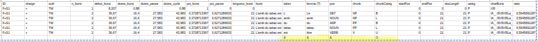
* ajout d'une ligne vide avec le symbole **&** pour montrer une pause
* les lignes "vides" (comportant des espaces ou suppression) sont gardé car ils ont des données implicites que nous retrouvons dans *charBurst*

#### JSON
```json
{ id_0 : {
			information : { "ID" : "F+S1",
                            "input_corpus" : "Formulation",
                            "charge" : "+",
                            "outil" : "TW",
                            "n_burst" : int,
                            ... }
			burst : "L'arrêt du tabac est",
			token : ["l", "arrêt", "du", "tabac", "est"],
			lem : [...], # peut être ignoré
			POS : [("l", DET), ()], # POS précis
			Pause : 0/1, #int
			Bust_categ : "", #str
			Chunk : [("L'arrêt", BL, NP),()] # sous forme de liste 

...}
```
* Dans les chunk, réunir les informations sur chunk et chunkCateg du csv pour avoir les informations du **O** pour les pauses ou les lignes vides
* On peut ajouter les données des autres colonnes

<div style="border:5px solid powderblue; ">
<span style="padding:1px; color:red; background-color:lightgrey; margin:5px"><b>Note :</b></span><br>
<div style="margin-left:15px">
B - 'beggining' 
I - 'inside' <br>
L - 'last' <br>
O - 'outside' <br>
U - 'unit' <br>
----------------- <br>
NP - 'nominal' <br>
VP - 'verbal' <br>
PP - 'preposition' <br>
GADJ - 'adjectif' <br>
GADV - 'adverbe' <br>
CONJC - 'conjonction' <br>
</div>
</div>

### Choix des modules de chunking et postagging
* SEM a un problème dans le chunking : certaines segmentations sont erronées, dans un chunk, nous retrouvons deux chunks
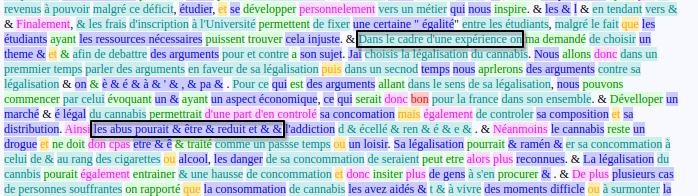
* Choix du module de chunking : NLTK
    - Les chunks étant erronés, et ne connaissant pas d'autres modules de chunking performants pour le français, nous avons décidé de construire manuellement un chunker via le module `nltk`, où le chunker marche avec les règles que nous donnons.
* Choix du module de postagging :
    |           | Stanza    | spaCy | Description |
    | --        | --        | --    | --          |
    | “du”      | ADP + DET | ADP   | stanza divide en "de+le" |
    | “space”   | skip      | SPACE | ignoré par stanza |
    | emp	    | X	        | NUM   | token du burst 1 : stanza reconnaît pour unknow, alors que spacy = number
    | êcher	| VERB	    | VERB  | token du burst 2 $\Rightarrow$ *empêcher* |
    | égalemn	| ADV	    | ADJ   | token du burst 1 : stanza = ADV ☑️ |alors que spacy = ADJ ❌ |
    | ent	    | ADV	    | ADV   | token du burst 2 $\Rightarrow$ *également* |
    | e	        | ADP	    | NOUN  | souvent une révision : oublie des terminaison (e/s/es...) |

    - Après un test rapide entre `stanza` et `spacy`, nous pouvons voir que `stanza` est plus performant et pour la plupart des tokens, plus adapté pour notre corpus et le français. Ainsi, nous avons choisi de prendre le module `stanza` pour l'étiquetages de nos tokens.

#### Amélioration
* *emp* + *êcher* que `stanza` étiquète **X+VERB** $\rightarrow$ changer par **VERB-1** et **VERB-2** pour avoir la liaison entre les deux.
    - La segmentation est ainsi car ce sont deux burst différents, **Hypothèse 1** : une pause ici pour trouver la touche avec le **^** sur le clavier ? $\rightarrow$ vérifier l'hypothèse avec la durée de pause
* *du* : garder l'étiquetage de spaCy qui semble être plus adapté pour notre cas, car l'automatisation est plus simple à faire et ainsi, nous avons qu'une seule ligne pour *du* et non *de+la* (sortie de `stanza`)
    - il faut donc regrouper tous les dispatch de `stanza` et changer l'étiquette en ADP $\Rightarrow$ *du* = **ADP**
* Créer un ou deux autres tags pour les burst qui *e*, *es*, *s*, *ees* qui sont souvents des oublies ou des corrections d'erreurs de terminaison du genre ou du nombre. Souvent présent pour les NC ou ADJ
* Ignorer les espaces dans le postagging, mais garder le vide dans la sortie finale

### Améliorations globales
* Ajouter un filtrage des données pour une meilleur comparaison des données par la suite (facilite l'analyse)
* Ajouter une catégories de POS et de chunk pour les ponctuations et préciser si c'est une ponctuation forte ou faible.
    - `punct_forte = [",", ";", ":"]`
    - `punct_faible = [".", "!", "?"]`

### Ouverture
* Pour le postagging, nous pouvons détailler (genre, nombre...), ce sont des données qui permettent une analyse plus fine et de répondre à des hypothèses avec plus de précision.
* Prendre en compte l'entourage de *du* pour avoir des POS adaptés aux différentes situation (différencier ADP+DET et DET)
* `stanza` saute toutes les espaces, or certains espaces comprtent des données cachées qui ne sont pas explicités dans les *burst* (ce dont nos analyses portent dans ce projet), mais dans les *burstChar*. Ainsi, trouver un moyen de prendre en compte ces données implicites pour avoir plus de données d'analyse.

## Rédaction du journal et postagging avec stanza (22/05)
* Mise au propre du journal de bord et rédaction des décisions prises lors de la réunion 2. 
    - Ajout des quelques détails pour une meilleur compréhension du journal pour les camarades suivants.
* Finaliser le script de postagging avec `stanza` en ajoutant les modifications mentionnées lors de la réunion 2.

## Postagging avec stanza - 2 (26/05)
- Vérification des tests à ajouté pour un POS plus précis et adapté au corpus.
- LAS (selon la diapo *Analyse des données d’écriture en temps réel* — Amandine Jouvenel) voir diapo p. 27-48.
- Utilisation de `explode` dans pandas : range chaque élément de la liste en un élément par ligne tout en répliquant les données des autres colonnes

Problème :
- sur Linux, le GPU n’est pas activé, il faut installer la carte NVIDIA et redémarrer l’ordinateur

## Postagging avec stanza - 3 (27/05)
* Définir les tokens à tagger LAS 
* Détaillé le tag pour les ponctuations 
    * punct_fort = [".", "!", "?"]
    * punct_faible = [",", ";", ":"]

## Postagging avec stanza - 4 (28/05)
- Correction automatique pour les pos=X, si en collant le text A et le text B (A token mtn, B token suivant), leur POS est le même que le pos du B, alors on ajoute une liaison avec `pos_A=POS_1` et `pos_B=POS_2`
- Après un premier test de la fonction `tok_stanza_for_df`, nous remarquons que le script prend plus de 2 minutes à traiter tous les documents, ainsi nous ajoutons une barre de progression avec le module `tqdm` au lieu de faire des plein de `print()` de progression.
- Réorganisation des colonnes, dans les premiers tests, les nouvelles colonnes (token et pos) se trouve en toute fin, alors que nous les voulons juste après la colonne burst.

## Correction des résultats de postagging (29/05)

### Manuel d'utilisation (`df2csv`, `postagging_for_df`)
- `df2csv` : Fonction de conversion DataFrame → csv/excel
    - `corpus` : `pd.DataFrame` qui peut être crée avec `read_corpus`, `tok_stanza_for_df` et `chunking`.
    - `path` : Fichier de sortie
    - `column` : Affiche que les colonnes sélectionnées. Par défaut, toutes les colonnes
    - `format` : Format de sortie, CSV ou Excel. Par défaut CSV.
- `postagging_for_df` : postagging des bursts avec stanza
    - `dataframe` : `pd.DataFrame` venant de `read_corpus`
    - `new_column` : le nom des deux nouvelles colonnes. Par défaut : token et pos

### Corrections
- Correction de *a* tagger en LAS, alors que c’est un VERB
    - comme *a* est en lui-même un burst, stanza ne le reconnaît pas → ajout d’un test pour corriger ce problème
- Correction de l’emplacement des variables `tok` et `postagging` pour pouvoir accumuler toutes les phrases d’un burst
    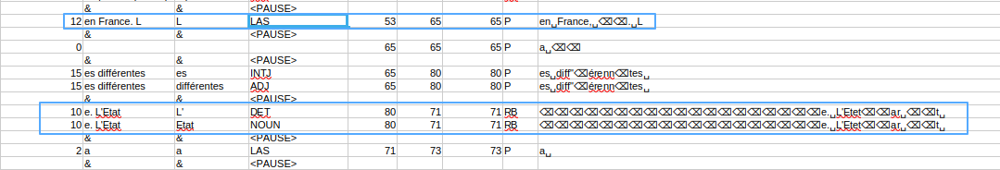
    * Ce qui est encadré en bleu sont les erreurs à corriger
    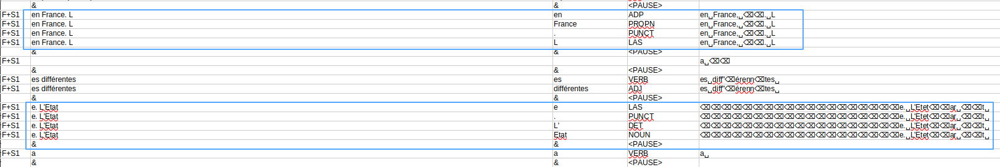
- Le tag des ponctuations n’a pas été corrigé, l’imbracation des tests n’est pas bien fait
- INTJ : l.34 “équent” n’est pas une interjection
- du ≠ de + le → corriger les du ☑️

### Test à effectuer
- [ ]  `df2csv()`
    - [ ]  avec une sortie en excel
    - [ ]  avec `column` sélectionné
- [ ]  Vérifier dans la sortie si pour *du* le pos a bien changé et que le token n’a pas été divisé en deux ou que le deuxième token ne soit présent

### A faire
- [x]  Finaliser le script de postagging avec `stanza` en ajoutant les modifications mentionnées lors de la réunion 2. **(29/05)**
- [ ]  Préparer les règles pour débuter le chunk avec nltk
- [x]  Pour le test du POS=X, ajouter la transformation du pos suivant aussi → ex: VERB_2 **(28/05)**
- [ ]  Vérifier la sortie de la fonction `df2csv`
    - [x]  df **(29/05)**
    - [ ]  dict → réécrire une fonction pour la conversion : prendre en compte, les token → list[token], pos = list[tuple(token, pos)] , chunk → list[ tuple(chunk, etiquette, syntaxique)]
- [ ]  Write2Json : passer par la fonction df2dict pour avoir la sortie json comme voulu et non pas identique au csv → trop redondant, avec des doublons inutils
- [ ]  Faire une fonction de filtre ⇒ choisir les pos ou token (chunk ?)

## Preprocess before chunking (01/06)
- NLTK chunk : manuel de fonctionnement de la création chunk manuelle.
    - Il demande en entrée une liste de tuple `[(mot, pos)...]`
- Fonction `df2dict` pour avoir la sortie en dictionnaire

## Etiquette syntaxique -- Chunk (02/06)
- `chunking` : prend une liste de `(mot, pos)` et rend en une liste de chunk `(sent, chunk_type)`.
    - Pour facilité la tâche, nous ne prenons que les tag chunk au premier niveau
- correction pour la sortie de `df2dict` : regroupe toutes les métadonnées non utilisé dans “information”

### Problème à corriger
- [x]  à → LAS
- [x]  d’ → ADP

## Chunker complet (03/06)
### Problème rencontré

- Dans la construction du dictionnaire (`df2dict`), la fonction ignore les lignes marquant la pause (*&*) car la fonction regroupe par “ID” et “n_burst”, or lors de l’ajout des pauses, ces deux colonnes n’ont pas de valeurs.
    - Pour corriger ce problème, nous avons ajouté l’ID du burst précédent et sur la base du n_burst précédent, nous ajoutons 0.5. Afin de différencier les pauses des bursts existent et pour qu’ils ne soient pas regroupé en une seule et même ligne (avec tous les n_burst = 0)
- ⚠️ Corriger l.94 (ajouter un test pour les tokens et pos vide)

### Progression

- rename `chunking`-> `chunk_type`
- `chunk_bilou` :
- `chunker` : réunit les deux fonctions précédentes pour l’étiquetage du chunk et donne le choix d’une sortie en dico ou en dataframe
- `dict2json` : fait

Le programme prend en moyenne 5 minutes
```python
# Test depuis `chunker_fr`
from tok_pos import *
from read_write import * 

chemin = "data/corpus"
reader = read_corpus(filesFromFolder(chemin))
test = postagging_for_df(reader)
dico = df2dict(test, True)
chunks = chunker(dico)
for i in range(len(chunks)) :
    if i < 35 :
        print(chunks[f"id_{i}"])
```

## Correction et debug (04/06)
- l.94 : ajouter un test pour `pos="<PAUSE>"` sinon NLTK bloque
- Pour pouvoir utiliser `explode` de pandas, il faut que la taille des valeurs dans les cellules soient identiques
    - id_2803 : le burst est un chiffre `burst=98` → Ajouter un test et une étiquette pour les NUM. Garder la même étiquette pour pos et type_chunk
    - Prendre en compte pos=AUX (ajouter dans `grammar`
    - id_25042 : Un seul DET → ajout d’un type_chunk=DET dans `grammar`
    - id_25060 : chunk vide pour les `token=[nan]` (ce sont les vides de pandas) ⇒ mettre en type_chunk un vide de pandas aussi
- Ajout d’un création des dossiers pour la fonction `df2csv`.

### Test
```python
 # Test 
from read_write import *
from tok_pos import *

# chemin = "data/corpus"
# reader = read_corpus(filesFromFolder(chemin))
# test = postagging_for_df(reader)
# df2csv(test, "data/postag/complet.csv")
chemin = "data/postag/complet.csv"
reader = read_corpus(filesFromFolder(chemin))
dico = df2dict(reader, True)
# chunk_dico = chunker(dico)
# print(chunk_dico["id_25060"])
chunks = chunker(dico, True)
# df2csv(chunks, "data/chunks/complet.csv")
df2csv(chunks, "data/chunks/complet_excel.xlsx", format="excel")
# print(chunks)
```

## Préparation réunion 3 (05/06)
### Préparation des fichiers
```python
# run in this file chunker_fr.py
from read_write import *
from tok_pos import *

chemin = "data/corpus"
reader = read_corpus(filesFromFolder(chemin))
test = postagging_for_df(reader)
df2csv(test, "data/postag/complet_df2csv.csv")
df2csv(test, "data/postag/complet_df2excel.xlsx", format="excel")

dico = df2dict(test, True)
dict2json(dico, "data/postag/complet_df2json.json")

chunk_dico = chunker(dico)
dict2json(chunk_dico, "data/chunks/complet_dict2json.json")

chunks = chunker(dico, True)
df2csv(chunks, "data/chunks/complet_df2csv.csv")
df2csv(chunks, "data/chunks/complet_df2excel.xlsx", format="excel")

df_to_dico = df2dict(chunks, True, True)
dict2json(df_to_dico, "data/chunks/complet_df2json.json")
```
* JSON ne peut pas sérialiser les `pd.NA` il faut convertir en `None`.
 
### Test à effectuer
- [ ]  `df2csv()`
    - [x]  avec une sortie en excel 04/06
    - [ ]  avec `column` sélectionné
- [x]  Vérifier dans la sortie si pour *du* le pos a bien changé et que le token n’a pas été divisé en deux ou que le deuxième token ne soit présent

### A faire pour
- [x]  Finaliser le script de postagging avec `stanza` en ajoutant les modifications mentionnées lors de la réunion 2.
- [x]  Préparer les règles pour débuter le chunk avec nltk 01/06
- [x]  Pour le test du POS=X, ajouter la transformation du pos suivant aussi → ex: VERB_2
- [x]  Vérifier la sortie de la fonction
    - [x]  df
    - [x]  dict → réécrire une fonction pour la conversion : prendre en compte, les token → list[token], pos = list[tuple(token, pos)] , chunk → list[ tuple(chunk, etiquette, syntaxique)] 01/06
- [x]  Write2Json : passer par la fonction df2dict pour avoir la sortie json comme voulu et non pas identique au csv → trop redondant, avec des doublons inutils
- [ ]  Faire une fonction de filtre ⇒ choisir les pos ou token (chunk ?)

### Explication dans le rapport 
#### Progression 21/05 - 05/06

Fonctions conçuent pour aboutir au résultat attendu :

- **read_write.py** :
    - `METADATA` : (constant) définit l’ordre et les colonnes que doient contenir le tableur final
    - `extension` : (fonction) retourne l’extension d’un fichier → *str*
    - `filesFromFolder` : extrait les fichiers d’un dossier donnée → *dict[str, list[str]]*
    - `read_corpus` : Extrait les données selon les colonnes sélectionné d’un fichier csv ou excel → *pd.DataFrame*
    - `df2dict` : Convertie un DataFrame en dict → *dict*
    - `dict2json` : Convertie un dict en fichier json → *<path>.json*
    ⇒ La conversion d’un DataFrame en json est aussi faisable, cepandant la conversion d’un df après traitement (postagging et chunking) rendra le fichier redondant avec les répétitions suite à explode des colonnes voulues. Ainsi il est préférable faire une première conversion (df → dict) pour enlever les doublons
    - `df2csv` : Convertie un DataFrame en fichier CSV ou XSLX → *<path>.<csv|xlsx>*
- **tok_pos.py** :
    - `postagging_for_df` : Tokeniser et postagger → *pd.DataFrame*
- **chunker_fr.py** :
    - `chunk_type` : Etiquetage syntaxique des chunks via NLTK → *list[tuple]*
    - `chunk_bilou` : Etiquetage bilou des groupes chunks syntaxiques après `chunk_type` → *list[tuple]*
    ⇒ L’étiquetage bilou se base sur l’étiquetage syntaxique, et ne tag pas par chunk (token) mais par groupe syntaxique de chunk pour faciliter la tâche
    - `chunker` : Applique les fonctions précédentes sur un dict → *dict | pd.DataFrame*

#### Résultat

##### After postag

**Excel : data/chunks/complet_df2excel.xlsx**

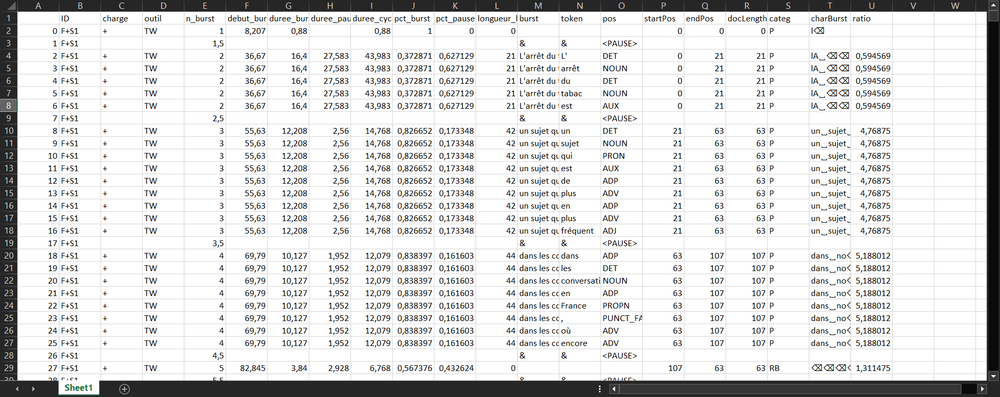

**JSON : data/postag/complet_df2json.json**

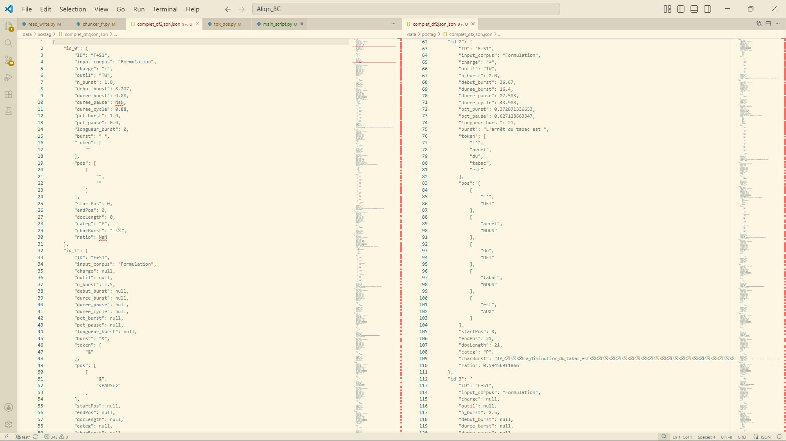

##### After chunk

**Excel : Align_BC/data/chunks/complet_df2excel**

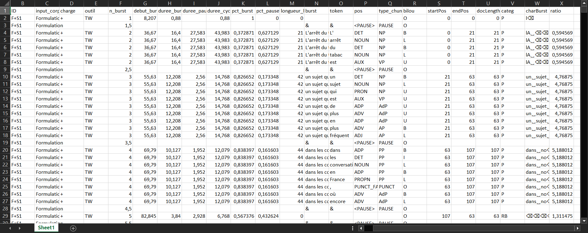

**JSON :** 

**data/chunks/complet_df2json.json**   |  **data/chunks/complet_dict2json.json**

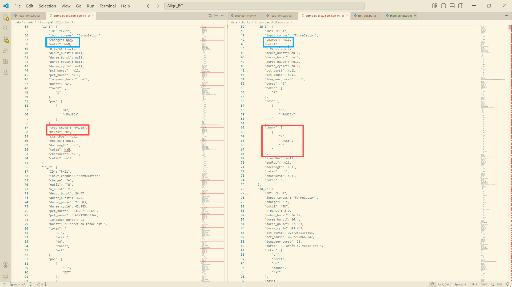

#### Questions

- INTJ : l.34 “équent” n’est pas interjection
    
    !Autres exemples INTJ
    
    Autres exemples INTJ
    
    **Comment corriger ?**
    
- Il y a une partie des LAS qui ont été reconnut comme X par le postag de stanza, est-ce qu’il faut corriger ?
- Est-ce qu’il y a besoin d’unifier les **null**, **NaN**, **nan**, **None** pour les vides ?
- Lors de l’étiquetage chunk, les tag <PRON> et <DET> été trouvé seul sans contexte dans les burst. Ainsi il était difficile de savoir sous quelle étiquette syntaxique chunk il fallait les ranger. Pour ne pas bloquer le script, j’ai ranger <PRON> sous **NP** et j’ai créé une étiquette chunk **DET** pour les <DET>. Un conseille ou une correction à apporter ?
- J’ai mis un tag <PAUSE> en pos et chunk pour les marques de pause. Il est possible de les supprimer et changer par du vide.

#### Remarque

##### Durée du programme

Le programme prend environ 7 minutes au total pour le postagging et chunking et avoir une sortie en excel/csv ou json

Le programme de postagging prend le plus de temps, il faut patienter un peu plus de 5 minutes. Ce temps d’attente est surtout dû au grand nombre de ligne que le programme doit parcourir et tagger. Dans ces 5 minutes, l’insertion des pauses (&, <PAUSE>) prend environ 30 secondes. L’explode des lignes avec pandas prend environ 1 minute.

!image.png

Le script pour le chunk et la sauvegarde au format JSON, Excel et CSV prend environ 1 minute. Comme avant de chunker, nous convertissons le DataFrame en dict, le script est plus rapide pour traiter ces données.

##### L’utilisation du chunker

Pour lancer le script pour chunker, il est impérativement obligatoire de lancer le programme de postagging avant. Le chunker de NLTK demande en entrée une liste de tuple avec le token et le postag → `[(token, POS)]`.

## Argparse (08/06)
- `json_reader` : lire un fichier json → *pd.DataFrame | dict*
    - A tester
- argparse
    - [x]  read_write.py
    - [x]  tok_pos.py
    - [ ]  chunker_fr.py
    - [ ]  main_script.py

## Réunion 3 (09/06)
- Corriger les types de chunks et certains POS
    - AUX = 1 chunk VP | Participe Passé = 1 chunk VP
    - PRON = NP
    - PRON + VERB = VP_cl
- Vérifier et corriger :
    - [x]  PP avec adp figé (”loin”…)
    - [x]  du / des / au / aux ⇒ ADP
    - [x]  (INTJ = LAS) + SPACE + SUPPR
    - [x]  adverbes figés 10/06
    - [x]  “de” en fin de burst relié au burst suivant
        - [x]  DET_NP (?)

## Correction postag (10/06)
Progression

- Ajout d’adverbes figés dans la liste
- Correction : les adverbes figés ne sont pas matcher
- Idée de traitement pour le chunk → relier fin et début de burst
    - Créer un dico_token qui range par id un dict comportant [”burst”, “token”, “chunk”]
    - Dans une boucle qui itère `dico_token`, → `if dico["burst"] == dico_token["burst"]` alors on range les chunk dans une liste (`chunk_list`) puis vérifier s’il n’y a pas de doublon
        - Dans la boucle, si le burst est une ligne vide, alors ajouter un chunk (SUPPR/SPACE)
        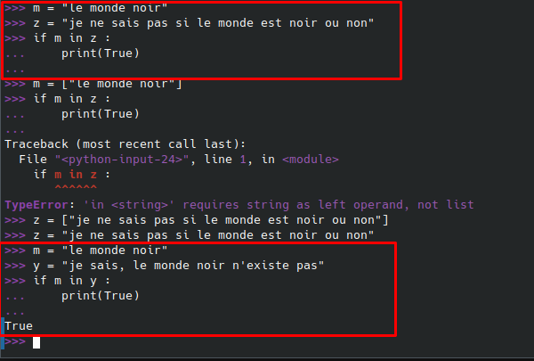
Ligne à vérifier après fin des task

- 715 : emp & êcher
- 732 : trente = NUM → vérification pour chunk
- 4608 : de plus même
- 63946 : sé & curité → burst = NP
- 39008 : décalage de colonne + séparation token faux → *;␣d* `tok={" d", " d"}`

Correction à apporter 

- [x]  dans la grammaire de `chunk_type` ajouter une gestion pour *trente ans* = **NUM+NOUN**

Correction faite :

→ adverbes figés
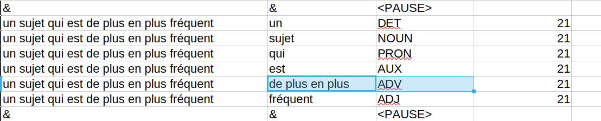
→ gestion des lignes vides = SPACE/SUPPR
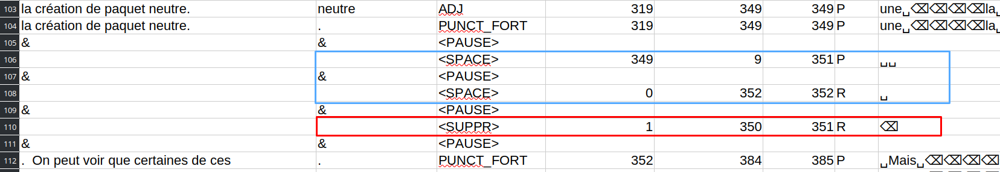

## Correction détaillée chunk 1 (11/06)

### Problème — question

Comment tagger les nombres :

- [ ]  l.6779-6781 : “15 à 25 ans” (*NUM+ADP+NUM+NOUN*)
- [ ]  l.8882 : “de 2 courant” (*ADP+**LAS**+NOUN*) → (*ADP+NUM+NOUN*)
    - [ ]  l.11054 : “de 23000 étudiants” (*ADP+NUM+NOUN*)
- [ ]  l.11654 : “12” = NUM (à garder ?)
La ligne est juste composé du chiffre 12
- [ ]  l.19246 : “la carte du bus est à 200” = NUM (à garder ?)
- [ ]  l.19843 : “juillet 2018…” (*NOUN+NUM*)
- [ ]  l.43085 : “du 09/12/16” (*ADP+**NOUN***)
- [ ]  l.50529-50511 : “8 décembre 2016” (*NUM+NOUN+NUM*)
- [ ]  l.50525-50527 : “Aujourd & ‘hui” (*ADV+<PAUSE>+NOUN*)

### Correction

- 1 nombre (ex: 2, 8…) ont été étiqueté LAS → ajout d’une restriction dans le test d’étiquetage de LAS
l.45 : `pos != "PUNCT"` → `pos not in ["PUNCT", "NUM"]` 
Evite de tagger les ponctuation et les numéro en LAS quand le nombre de caractère est en dessous de 3

### Explication — progression

Pour prendre en compte les burst d’avant et d’après dans l’analyse du chunk, j’ai décidé de ranger tous les listes de (token, pos) dans une seule liste et traiter le tout dans la fonction de `chunk_type`. Ainsi l’analyse chunk prendra en considération tout le contexte.

### Problème — script

- Refaire `chunk_bilou`
    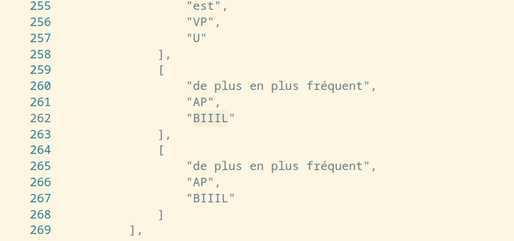
- Enlever les doublons → changer `result["chunk"] = []` par une liste simple et transformer la liste en tuple pour enlever les doublons puis affecter à `result["chunk"]`.
❌ 12/06 : possible de supprimer les qui ne sont pas des répétitions successives
- Corriger les `pd.NA` pour qu’il n’y ait plus de faute pour l’extraction dans la conversion avec `to_df=True`.
    
* Vérifier la fin pour voir si cette ligne pose problème ou non 
    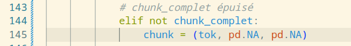

## Correction détaillée : chunk 2 (12/06)

### Problème — correction

- [x]  Doublons des chunks en raison d’une itération sur les tokens
    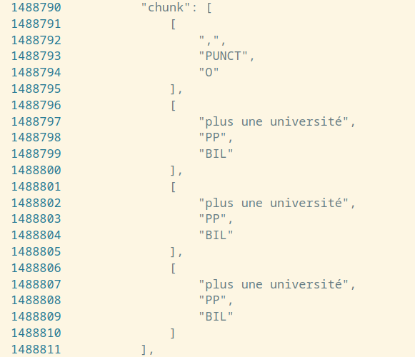
- [x] Les derniers chunks sont souvent tagger comme null alors que le tag chunk existe
    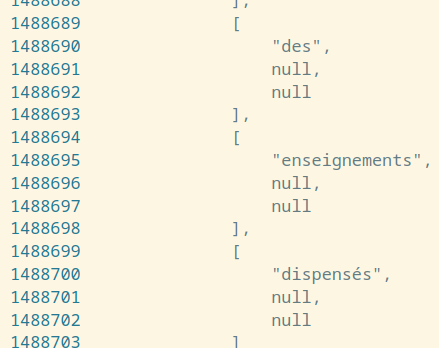
- [x] Il y a des tokens qui n’ont pas été chunker alors qu’ils ont un pos
    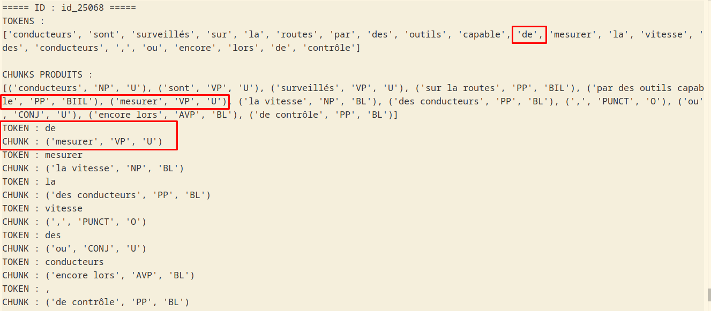
⇒ La plupart est du à un décalage car certain pos n’ont pas été reconnu dans la formation du chunk_type

- [x]  Les VP_cl ne sont pas reconnu → NP + VP
⇒ ajouter une description ou un plus pour le PRON format le VP_cl en utilisant `deprel=expl:com` = PRON_comp
PRON + PRON_cl + VERB
- [x]  Corriger `pd.NA` ou `None` pour ne pas bloquer la convertion avec `to_df = True`.
- [x]  Corriger `chunk_bilou` pour que les adv figés soient comptabilisé comme 1.
- [x]  Prendre en compte les ADP figés

### Ajout de code

- Pour former les VP_cl (*tok_pos.py*)
    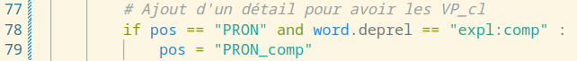
→ ne prenait que “y” en compte ⇒ correction 

```python
# Ligne 78
if pos == "PRON" and (word.deprel in ["expl:comp", "expl:pv"]) :
	pos = "PRON_cl"
```

### Correction -- accompli
* ADV/ADP figé
    
* PRON_cl

### Questions chunk
- id_25068 : “… de mesurer …” → ADP + VERB
Pour cette exemple, comme dans la grammaire de construction des chunks, l’étiquette ADP n’apparait que pour le groupe PP (ADP + NP), ainsi lorsque nous avons des ADP seul ou qui se trouve avant un verbe à l’infinitif, le script ne peut pas le reconnaître et le skip.
Pour régler ce problème, est-ce que dans la règle de grammaire, il faut ajouter une étiquette ADP seul ou ranger cette forme (ADP+VERB) dans VP ?
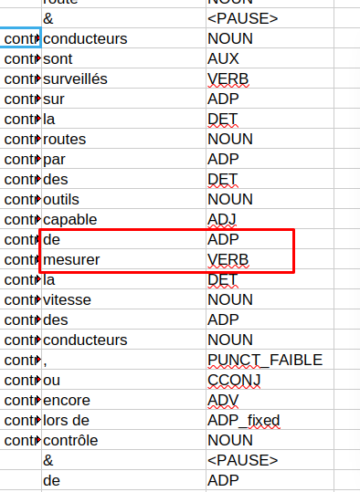
⇒ PP
- l. 37571 : “… Il n’y avait…”
    Comme *y* fait parti des pronoms clitiques français, est-ce une forme de groupe verbal clitique ?
    Si oui, dois-je ajouter dans la règle de grammaire des chunks ce groupe : PRON+ADV+PRON_cl+AUX ?
    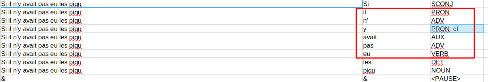
    ⇒ Il y avait = VP
    Il NP / n’ ADVP / y avait VP
- Pour mieux les traiter et distinguer les pronoms clitiques des autres pronoms, j’ai procédé à un ajout de détail dans le pos (⇒ PRON_cl). Cependant, dans les règles grammaticaux du chunk que nous avons défini dans la précédente réunion, la composition d’un VP_cl est obligatoirement  **{<PRON>+<VP>}**. Est-ce correct de le changer ainsi : **{<PRON>?<PRON_cl><VP>}** pour pouvoir traiter les cas comme ci-dessous
    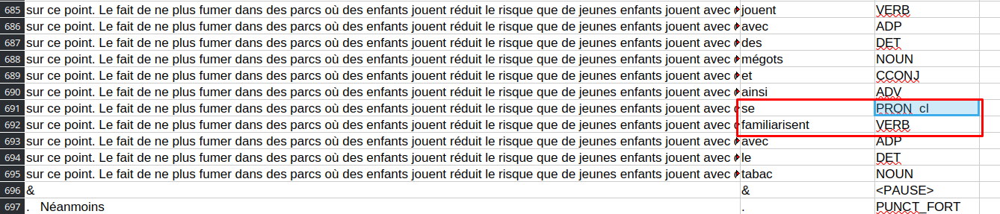
    ⇒ VP

## Correction détaillée : chunk 3 (15/06)
### Choix des types de chunk 

1. Ajout d’un `PP_brok`, pour les prépositions cassé en raison de fautes d’orthographe et de mal reconnaissance des POS de stanza
    
    → Voir l’exemple avec **id_19214** où *de la ou* est en réalité *de là où* considérant comme PP de la phrase précédente.
    
2. Dans les groupes nominaux, ajouter le pos NUM pour traiter les dates que l’on peut considérer comme groupes nominaux temporels
3. Ajout d’un NUM seul pour le type NP pour 
*l.19246 : “la carte du bus est à 200”* 
4. Correction dans VP_cl car les pronoms clitiques ont été repéré et postag par *PRON_cl* plus tôt dans le traitement avec stanza
    Ainsi, nous avons toutes les pronoms clitiques reconnuent
5. Ajout de tag pouvant être sélectionné en tant que PP pour régler les problèmes comme : *de mesurer* avec *mesurer* comme VP, prise en compte des VP_cl qui peuvent avoir le même cas (?)
6. Dans le prétraitement avec stanza, ajout d’un détail pour les adverbes figés ⇒ pos = ADV_fixed
    De même pour les ADP → ADP_fixed
7. A corriger, l’étiquetage des NUM semble quelques fois incorrecte <br>
    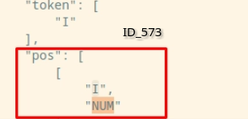
8. Corriger les ADP seuls <br>
    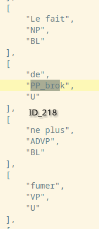
9. DET seul <br>
    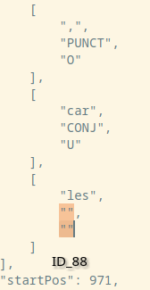
10. Comment traiter km/h ? sachant que km=NOUN=NP, /=SYM=UNKNOWN, h=LAS=LAS <br>
    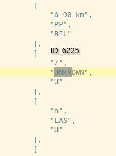

### Correction postag
Pour que les signes comme € ou % ne sont pas reconnus pour LAS <br>
    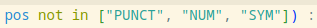

### Résultat final
#### Commande de test
```python
chemin = "data/corpus"
reader = read_corpus(filesFromFolder(chemin))
postag = postagging_for_df(reader)
dico = df2dict(postag, True)

chemin1 = "data/postag/postag_df.csv"
df2csv(postag, chemin1, format="csv")
df2csv(postag, "data/postag/df_excel.xlsx", format="excel")
dict2json(dico, "data/postag/postag_dict.json")

chunk = chunker(dico)
dict2json(chunk, "data/chunks/chunk_dict.json")

chunk_df = chunker(dico, True)
df2csv(chunk_df, "data/chunks/chunk_df.csv", format="csv")
df2csv(chunk_df, "data/chunks/df_excel.xlsx", format="excel")
```

#### Sorties du test
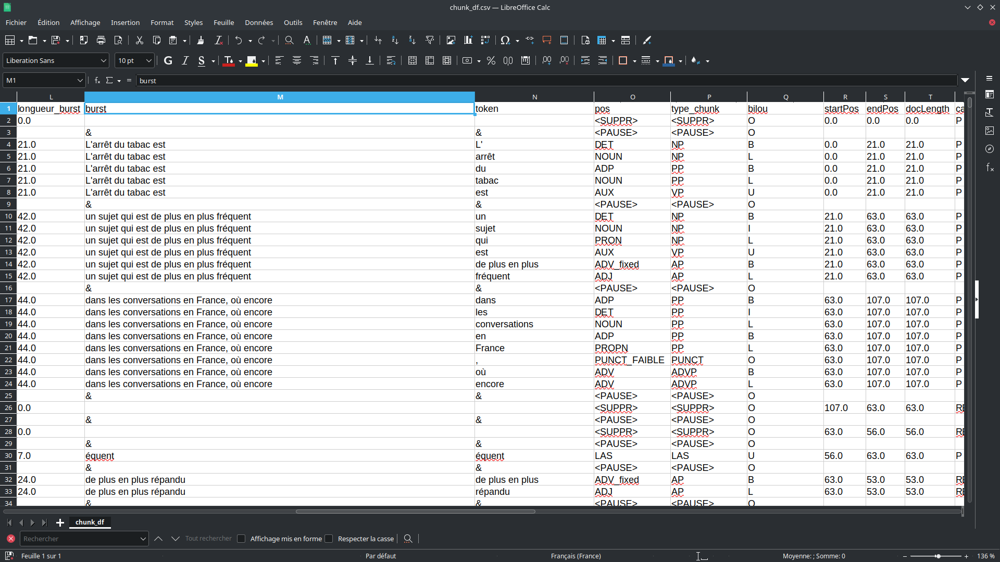
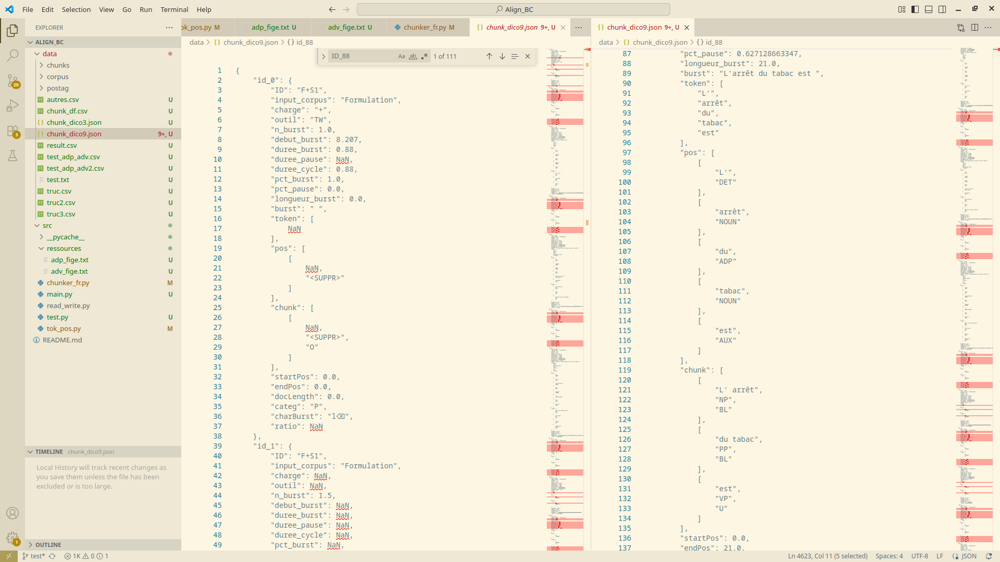

## Démarche suivante (16/06)
- Plan pour la prochaine fois
    - [ ]  Finir argparser
    - [ ]  Ajouter un filtre
    - [ ]  Finir main.py
    - [ ]  Préparer la réunion de jeudi
        - [ ]  Réunir les problèmes et questions rencontrées
- argparser `main_script.py`

## Préparation réunion 4 (17/06)
- [x]  Affichage (`chunker_fr.py`)
- [x]  Affichage (`tok_pos.py`)
- [x]  Affichage (`reader_write.py`)
- [ ]  Correction, prendre en compte les burst suivants dans le traitement des chunks
- [x]  Filtre

### Compte-rendu avant réunion 4
#### Progression
* Ajout d'un chunk `PP_brok` pour les DET et ADP seul
* Correction du traitement de NUM qu'on considère pour NP
* "de mesurer" entre dans le chunk `PP`
* Correction du comptage BILOU pour les expressions figés. Les expressions figées valent 1 token au lieu de plusieurs.
- Pour traiter les expressions figées, une précision a été faite dans les étiquettes POS (ADV et ADP)
- Dans les étiquettes du POS, une autre précision a été faite pour les pronoms clitiques ⇒ `PRON_cl`
- Correction de la reconnaissance de LAS pour que les signes (”€”, “%”…) soit bien tagger SYM (selon stanza)
- Ajout d’une étiquette `UNKNOWN` pour traiter les étiquettes X ou SYM de stanza
    - <m> = SYM → UNKNOWN
    - et / ou = SYM → CONJ
    - Permis / voiture → CONJ
    - / grave → SYM / UNKNOWN
    - à 99
    % → NP U
    - également une dépendance / une addiction → CONJ
- Ajout d’une fonction pour filtrer (pas encore testé)

#### Question
* Garder ce traitement pour *km/h* ou bien regrouper ? Si nous regroupons, quel tag mettre pour POS et chunk ?
    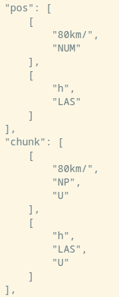

## Réunion 4 (18/06)
### Contexte de la réunion 
- DET et ADP et PP_brok : utiliser BILOU pour montrer que c’est cassé
    <br> ex : DET + ADP = BI
- ADV_fixed → ADV_mwe (multiword expression)
- ADP_fixed → ADP_mwe
- NUM
    - 15 à 25 ans → 15 (NUM) à 25 ans (PP)
    - à 200 → PP
    - Ce mois de juillet 2018 → Ce mois (NP) de juillet 2018 (PP)
    
    ⇒ NUM n’est pas la tête du chunk donc quand le pos suivant est un nom, il joue le rôle de DET, ainsi, il fait parti d’un chunk nominal (NP)
    
    ⇒ Quand le NUM est seul, il n’y a pas de tête de chunk, donc il garde comme tag NUM
    
- Pour le traitement des SYM
    - \<m> = SYM → UNKNOWN <br>
    Il y a pas de contexte dans lequel ce symbole peut signifier quelque chose. <br>
    On dirait plutôt une faute de frappe, surtout les deux bursts suivant sont des frappes de suppression (au nombre de 3, assez pour supprimer ces trois caractères)
    - également une dépendance / une addiction → CONJ
    - Permis / voiture → CONJ
    - et / ou = SYM → CONJ <br>
    Il est possible de donner une signification syntaxique pour ce symbole. Dans ce burst le symbole “/” est interprété comme la conjonction “ou”
    - / grave → SYM / UNKNOWN <br>
    Sans contexte précis, nous ne pouvons trouver une signification syntaxique pour le symbole, ainsi, il est préférable de tagger comme SYM ou UNKNOWN
        - à 99 <br>
        % → NP U <br>
        Il est utilisé comme un adjectif ou déterminant (ex: à la maison) ainsi, son type de chunk serait NP ou PP
    
    ⇒ Quand SYM fonctionne comme un nom, son type de chunk est nominal, par exemple quand il suit un chiffre = NP/PP
    
    ⇒ l’étiquetage de SYM dépendant 
    
- “*Il y a*” est aussi une expression figées qui fait parti d’un seul et même chunk (VP_cl ou VP si sans différence). Cependant, pour “*Il n’y a*”, l’ajout de la négation casse le groupe, l’étiquetage chunk serait : NP+ADP+VP.
- km/h est aussi une forme figée que nous pouvons dans le chunk divisé en deux partie (NUM+km) + (/+h) avec NUM+km (NP) et /+h (PP) car le symbole “/” est interprété comme “par”, donc en tant que conjonction.

### Questions rencontrées
- Des biais (ou $\leftrightarrow$ où, a $\leftrightarrow$ à, es $\leftrightarrow$ est) dont nous ne pouvons intervenir directement dans le corpus. Nous ne pouvons que les montrer lors du prétraitement au niveau du POS (ajouter une marque pour dire qu’il y a une erreur d’orthographe). <br>
    Cependant, vu le nombre d’occurrence total que nous avons, il est difficile de faire un prétraitement automatique, car nous ne savons si ces erreurs sont global sur tout le corpus ou juste que pour quelque occurrence. Pour ce cas là, il serait conseillé d’ajouter une nouvelle colonne de POS_correction_manuel pour corriger un à un ces erreurs. Ce genre d’erreur devrait être corrigé au niveau de stanza.
- Est-ce qu’il y a besoin de différencier les NUM chiffre et écrit ? À l’écrit, les chiffres devraient tous être à l’écrit, cependant dans le corpus il n’y a pas souvent de distinction entre les deux usages. Pour ne pas se compliqué trop la tâche, surtout en raison de la limite de temps, nous n’irons pas dans les détails

### But d'analyse de la recherche
But final : **Voir comment s’aligne les bursts et chunks, est-ce qu’il y a une frontière entre les bursts et chunks ?**
> Réponse d’amont : Pas de correspondance absolue

Plan d’approche :
1. Combien y’a-t-il de cas en correspondance ? Combien de cas sans correspondance
2. Il y a des cas de correspondance entre frontière burst et chunk mais plusieurs chunk sont à l’intérieur d’un burst.
    - Combien de cas en % pour chaque corpus (for, pla, rev, +/-)
        - Les résultats par sous-corpus
        - Le résultat du corpus entier
3. Quel type de chunk il y a, avec et sans correspondance entre frontière burst et chunk ? <br>
    Quel type de chunk ayant le cas de figure 2 où un burst a plusieurs chunk ?

### Plan de la semaine prochaine
- Corriger les chunks fautifs
    - [x]  PP_brok → Unit_brok
    ex : DET+ADP = BI (sans le L pour marquer qu’il n’est pas fini)
    - [x]  NUM
        - [x]  NUM (chunk_type) :  pour quand le numératif est seul
        - [x]  “09/12/16” : NUM et garder comme NUM pour ckt (chunk_type)
        attraper via `re`.
        - [x]  NP/PP si entouré de nom
    - [x]  SYM
        - [x]  Si le symbole a une signification syntaxique, attribuer l’étiquette syntaxique en lien <br>
        ex : et / ou = SYM → CONJ <br>
        ex : 90% = NUM+NOUN ⇒ NP/PP
        ⇒ peut être directement changé dans le POS
        - [x]  Si aucune relation n’est trouvé dans son entourage, garder comme UNKNOWN ou SYM <br>
        ex : \<m> = SYM → UNKNOWN
    - [x]  NUM + km = NP
    / + h = PP
- Corriger le compte de BILOU
Ajout d’un test pour les broken
- Renomer les POS
    - [x]  ADV_fixed → ADV_mwe
    - [x]  ADP_fixed → ADP_mwe
    - [x]  il y a : PRON+PRON_cl+AUX → VERB (?)
- Vérifier le nombre d’occurrence des biais (ou $\leftrightarrow$ où, a $\leftrightarrow$ à, es $\leftrightarrow$ est) et proposer une démarche pour corriger les fautes si faisable
    - Vérifier l’entourage des biais pour voir s’il est possible de faire une correction automatique à partir de ça
    - Si il y’a pas bcp d’occurrence concernant, créer un automatisme qui corrigeant dans une nouvelle colonne les ID concerné
    - S’il y a trop d’occurrence, et qu’il n’est pas possible de trouver un moyen automatique de corriger, écrire aux tutrices et se concerter lors de la prochaine réunion pour en décider de la démarche à suivre

## Correction avec explication (19/06)

- Pour *il y a*, ayant besoin de regrouper pour le chunk, mais ne sachant quel POS mettre pour le groupe, plusieurs possibilités :
    1. regrouper *il y a* en 1 token (même traitement que pour les ADV / ADP figés), attribuer un POS=VERB et type syntaxique chunk = VP
    2. garder séparer (chaque mot = 1 token ⇒ 3 tokens) et ajouter dans la reconnaissance des verbes clitiques les AUX ( `{<PRON>?<PRON_cl><VP|AUX>}` pour que l’auxiliaire *a* dans *il y a* soit pris en compte)
- Renomer PP_brok en Unit_brok pour englober DET seul et ADP seul, ainsi il n’y a pas besoin de créer de faux catégories syntaxiques dans le traitement chunk. Utiliser BILOU pour montrer que ce sont des unités cassées (manquant leur suite) <br>
    Par exemple, lorsque l’Unit_brok n’a qu’un token, nous metton B (Begin) explicité d’une certaine suite inconnu qui peut être présent dans le burst suivant (après la pause). Un même traitement avec plus d’un token, à la différence que cette fois-ci, nous ajoutons le signe I (Inside) après B. Le nombre de I dépendra du nombre de token présent total -1 (il faut enlever un token pour l’identifier comme B)
- Selon 2.2 Le French Treebank (FTB) et ses étiquettes (Isabelle Tellier, Iris Eshkol-Taravella, Yoann Dupont, Ilaine Wang, « Peut-on bien chunker avec de mauvaises étiquettes POS ? », *21ème Traitement Automatique des Langues Naturelles*, Marseille, 2014, page 3), un groupe prépositionnel prend comme tête une préposition et est la plupart du temps suivi d’un groupe verbal ou nominal. Ainsi, pour régler le problème des prépositions qui ont du mal à intégrer les groupes de grammaire syntaxique (chunk), j’ai choisi de considéré un ou plusieurs préposition à la suite comme groupe prépositionnel sans qu’il soit obligé d’avoir un VP ou NP à la suite.
- Pour certains SYM, renomer avec une précision sur son utilisation syntaxique pour avoir un traitement chunk plus conforme et détaillé, ainsi les SYM ne seront pas tous reconnus comme UNKNOWN.<br> 
    Le choix de la précision est simple, selon la traduction du SYM en langue naturel, nous distinguons si c’est un usage plutôt prépositionnel (km/h), nominal (90%) ou conjonctionel (et/ou). Le reste, lorsque nous ne trouvons de signification concrète en langue naturel, nous le classons dans UNKNOWN.
- La reconnaissance des nombres (NUM) par stanza s’avère quelque fois fautif. Lorsqu’il analyse une suite de chiffre représentant une date (ex: 19/06/26) le pos attribué est NOUN, or en réalité ce sont des NUM séparé de SYM que nous classons en NER (Reconnaissance des Entitées nommées) comme date. Cependant, il n’est pas cohérent de mélanger de la syntaxique (POS) à la sémantique (NER). Ainsi, nous avons choisi de corriger le pos d’origine par NUM, qui est plus adéquat et pour l’étiquetage chunk, des corrections ont été apporté sur ce point aussi. <br>
    Quelques légères modifications ont été apporté dans la règle grammaticale de l’étiquetage chunk. Tout d’abord, nous avons ajouté une nouvelle étiquette NUM pour toutes les situations où le numéral se trouve dans un burst sans relation nominal. Avant cela, tous les NUM étaient considéré comme des groupes nominaux (NP). Ainsi, cela nous amène à changer la reconnaissance des nombres en tant que NP. Pour qu’un NUM soit marqué pour NP, il doit obligatoirement comporter un POS NUM et un SYM (ex: 90%) ou bien qu’un NUM soit suivi d’un nom (NOUN), pronom (PRON / PRON_cl) ou nom propre (PROPN) (ex: 25 ans). Ou encore qu’il soit similaire à un ADJ, donc précédant l’un de ces dernières étiquettes (ex: article 5).

### Correction -- problème
* Le traitement pour *km/h* de stanza n'est pas unifié. La plupart du temps, il le traite : km = NOUN, / = SYM, h = NOUN

### Idée de traitement pour chunker sur tout 
- Ranger tous les pos dans une grande liste avec un tuple de séparation nous permettant de savoir à quel id il appartient.
- Remettre en burst en comparant le nombre de tuple de pos dans un burst et le nombre de slots dans le chunk (compter bilou au lieu des tokens).
    - On itère globalement sur la liste de tuple de pos, lorsqu’on rencontre un tuple d’ID, alors on change l’ID du dico (pour faire l’append) 

    ⇒ Ainsi, il faut mettre l’ID au devant
        
        ```python
        		chunk_par_id = {}
            pos_id = []
            pos_complet = []
            for k in dico.keys():
                pos_comp = [
                    tuple(t)
                    for t in dico[k]["pos"]
                    if len(t) >= 2
                    and t[1] not in ["<PAUSE>", "<SUPPR>", "<SPACE>", "", " "]
                    and not (isinstance(t[1], float) and pd.isna(t[1]))
                ]
                creation_pos_id = [(f"ID_pos_{k}")] + pos_comp
                pos_id.append(creation_pos_id)
                pos_complet.append(pos_comp)
            chunk_par_id[k] = chunk_bilou(chunk_type(pos_complet)) if pos_id else []
        ```
        
    - Si `len(tuple(pos)) > len(bilou)` alors on vérifie si les tokens du tuple sont présent dans le groupe de chunk, si oui, on le mets dans la liste de chunks du dict de l’id en question (vérifier l’id avec la liste `pos_id`.
    - Si `len(tuple(pos)) > len(bilou)` alors on vérifie si les tokens du tuples sont présent dans le chunk, si oui, on le met dans la liste (?) <br>
    Attention, si le chunk suivant contient le token mais qu’il ne fait pas parti de ce groupe de token restant !
    ⇒ ajout d’un test d’amont pour voir si le nombre de bilou total correspond au nombre complet de tuple de pos (?)
    - Sinon on passe au prochain groupe de chunk.

### Plan  suivant
- [ ]  Vérifier les corrections apporter (chunk et pos)
    - [ ]  Unit_brok 〰️
    - [x]  ADV/ADP_mwe
    - [x]  SYM
    - [x]  NUM
    - [x]  il y a ❌
    - [x]  km/h (avec h=NOUN et non LAS)
- [ ]  Corriger l’utilisation des comandes `python chunker_fr.py chunk -b` pour que les arguments donnés soient reconnus comme liste de tuple (à faire pour -b et -ck)
La correction doit être faite pour `chunker.py` et `main.py`.
- [ ]  Vérifier les différentes sorties (sans / avec export) (csv, json, excel)
    - [x]  csv (dossier → traitements → csv)
    - [x]  json
    - [x]  excel
- [x]  Vérifier les différentes fichiers ou dossier d’entrée(s)
- [x]  Vérifier l’affichage classique
- [x]  Vérifier la commande filter
- [ ]  Faire le dernier point de **Plan de la semaine** en ajoutant un autre biais (sur $\leftrightarrow$ sûr)

## Correction chunk -- NUM SYM (20/06)
**Biais**
* '*es*' est reconnu comme VERB alors que c'est la suite d'une production de '*Les*'séparé par une ligne de suppression (l.42)

**Correction**
* ADP seul et Unit_brok (l.118) <br>
    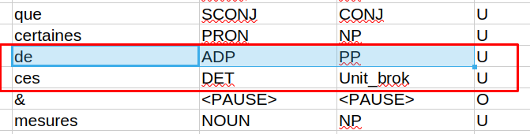
* NUM et km/h
    <br> 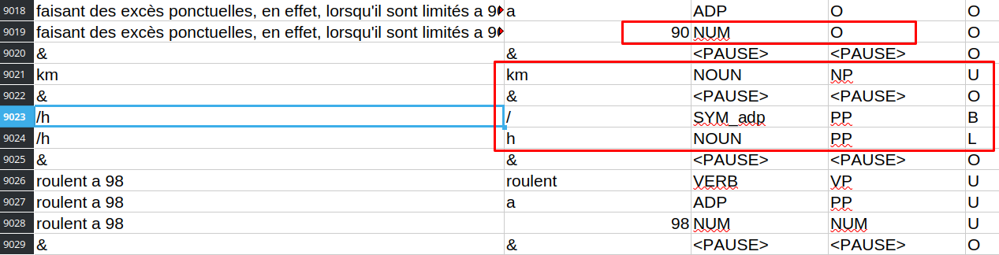
    <br> 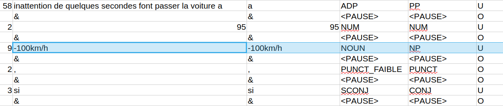
    <br> 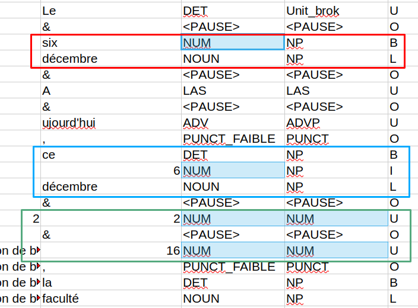
    <br> 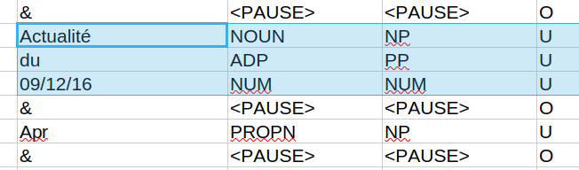
* SYM
    <br> 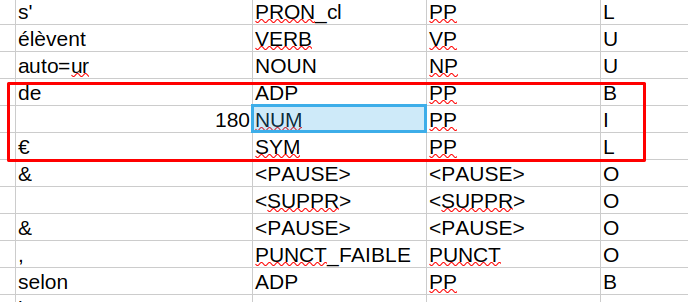
    <br> 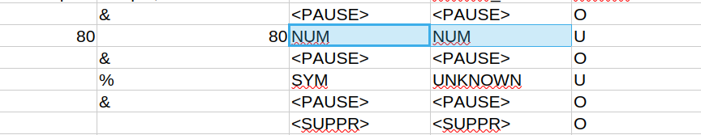
    <br> 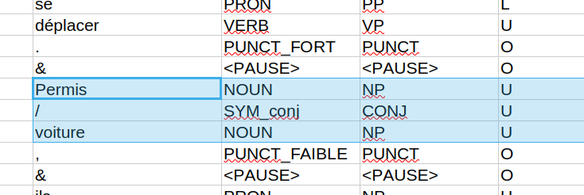
* Changer le traitement automatique de : "le(s) plus/moins"
    <br> 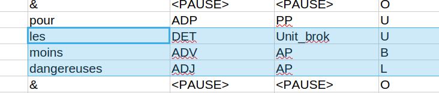

## Correction chunk -- PRON_cl LAS (22/06)

* Enelever `PRON_cl` de `NP`, sinon `VP_cl` ne sera jamais reconnu car `PRON_cl` seront toujours étiqueté pour `NP` avant.
    * Problème : Les `PRON_cl` seuls (souvent en raison d'une faute d'orthographe "se" -> "ce" l.3688)
    * Il existe des cas où il y a un `PRON_cl` avant un PRON (l. 14897 "s'en rendent compte")
* `DET+ADJ` après correction des `PRON_cl`, il sera compté pour `AP`, or dans ce contexte, il devrait être NP car il désigne une chose ultérieure.
    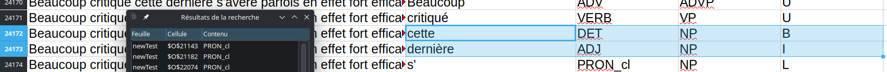
* il peut exister plusieurs pronoms clitiques à la suite 
* [ ] Vérifier tous les LAS (surtout ceux qui pourrait être des DET ou ADV)
    * Une petite partie des DET qui dans la sortie finale, ont été séparé de leur signe (ponctuation) indiquant leur POS
* [ ] Corriger la sortie JSON : les cellules vides posent problèmes pour l'affichage JSON <br>
    Les `pd.NA` et `np.nan` ont été changé par `None` pour que json puisse auto-convertir en **null** (vide supporté par json). Ainsi, le filtre interne du navigateur de json peut fonctionner.
    ```bash
    python main_script.py process ../data/corpus/ -p -c -o ../data/chunks/jsonTest.json -f json
    ```

A vérifier 
-
* [ ] La sortie json pour le filtre
* [x] Tester plusieurs colonnes ou items sélectionnés

## Biais et problème suite aux fautes de frappe (23/06)

### Problèmes -- les décalages et non reconnus
* ADV_mwe n'est pas reconnu
* "se" -> "ce" : faute de frappe qui fait qu'un DET est reconnu comme PRON_cl
* "u" seul a été reconnu pour "du" (à+le=du)
* Décalage des chunks avec les tokens. 
    <br> 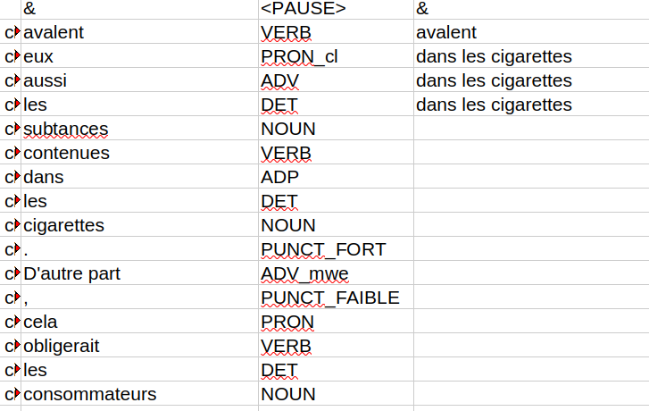
* Décalage des colonnes 
    <br> 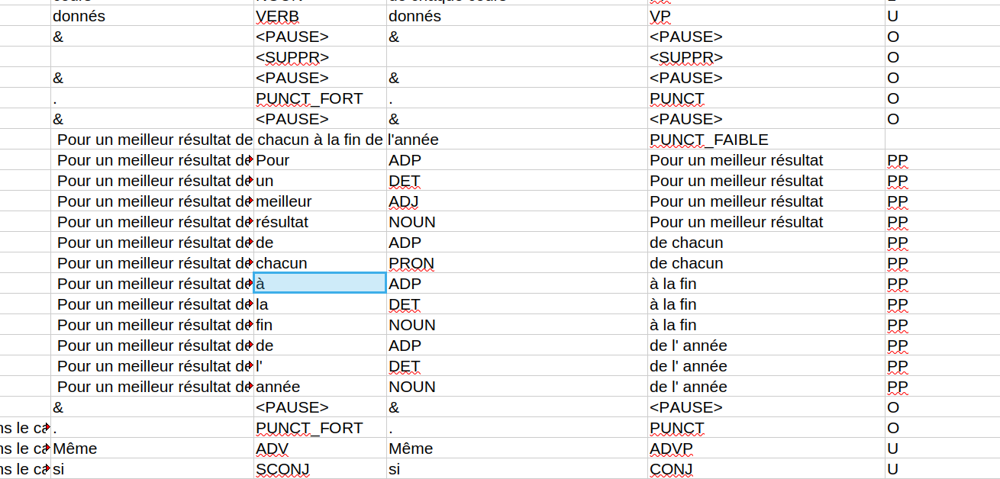

### Biais 
* se -> ce : un seul existant
* ou
    * ou -> où : 18/370
    * ou -> au : 1/370
    * ou -> ??? : 2/370
* où -> ou : 3/58
* es 
    * es -> est : 5/149
    * es -> LAS : 90%
    * es -> et : 1/149
* est -> xxx : ?/1003
* a -> xxx : ?/778 
* à -> a : 19/1026

### Nouveautés
* Fonction `python main_script.py filter` qui permet de filtrer les items et les colonnes 
* Ajout d'une colonne `chunk`, un ligne est un groupe syntaxique (=chunk).
    <br> ![ex: L'arrêt du tabac est == [L'arrêt] [du tabac] [est]](img/new_chunk_line.png)

## Réunion 5 (24/06)
### Compte rendu
- VP : <br>
    *marche, elle marche, ne marche pas, elle ne marche pas, a marché, elle a marché, elle n'a pas marché, elle a bien marché, elle n'a pas bien marché*
    <br>
    ajouter une colonne pour préciser s’il y a la négation ou non (0/1)
    <br>
    → pour faciliter la tâche, nous avons décidé de ranger tout ce qui consitue un VP ensemble sans distinction de ceux qu’il y a à l’intérieur (adv, adp…). Au besoin de nos analyses, nous allons ajouter une colonne pour préciser l’existance de la négation. Si 0, il n’y a pas de négation, sinon 1.
    <br>
    ⇒ Ce choix a été fait par rapport aux statistiques que nous devons faire plus tard. En raison d’une limite de temps (stage de 2 mois), nous avons choisi la façon la plus simple a mettre en place et le plus cohérent avec les conventions déjà présentes.
    
- Marquer une certaine continuité via BILOU pour les PP cassé
    - Par exemple pour “la plus” qui est un chunk incomplet si la tête existe, sinon on étiquette comme UNKNOW
- Pour les caractères impossibles à interpréter (DET seul ou LAS…) utiliser UNKNOW pour suivre les règles du chunk et ne pas ajouter de nouvel étiquette pour encombrer nos règles.
- Pour les NUM qui sont à l’intérieur d’un PP ou NP, les considéré comme NOUN ou DET, s’ils sont seul sans entourage, les étiqueter comme NUM.
- Corriger certains biais dans le POS qui puisse nuire à l’étiquetage chunk
    - à $\leftrightarrow$ a
        - a → prép : avant un NP et après un DET
    - ou $\leftrightarrow$ où
    - es → LAS car près de 90% des es sont des oublis/ajouts de révision ou production.
        - les rares fois où les “es” sont VERB ou AUX, apporter une modification (?)
- Refaire la fonction chunk pour qu’il fasse sans les pauses (similaire au postagging) puis ajouter les pauses selon les bursts.

### Hypothèse d'analyse

Si l’hypothèse est forte, alors il y a une correspondance absolu entre les burst et chunk. Si c’est vrai, les frontières entre burst et chunk devrait correspondre. Cependant, c’est faux, selon les étude déjà faite mais aussi car nous savons qu’il y a plusieurs type de burst (par exemple, les chunks incomplet du aux burst de révision)

Plusieurs cas d’approche pour répondre à notre hypothèse :

- les cas de correspondance et de non correspondance entre les frontières
- combien de cas avec correspondance ?
- on ajoute une information, nous prenons les chunk avec différents types de burst (P, RP, R). Combien y’a t il de cas avec/sans correspondance ?
- Ensuite, nous regardons les types de chunk
    - on prend un ensemble de chunk et un type de burst ppour quand les frontières correspondent et les frontières ne correspondent pas.
- Certains nombres de variable qui change la segmentation, donc prendre à tour de rôle les variables pour mieux comprendre
- Un burst a plusieurs chunk, quel type de chunk sont à même d’aboutir pour faire les types de burst long (normalement un burst de production P)

### But d'analyse
But final : **Voir comment s’aligne les bursts et chunks, est-ce qu’il y a une frontière entre les bursts et chunks ?**

Réponse d’amont : Pas de correspondance absolue

Plan d’approche :

1. Combien y’a-t-il de cas en correspondance ? Combien de cas sans correspondance
2. Il y a des cas de correspondance entre frontière burst et chunk mais plusieurs chunk sont à l’intérieur d’un burst.
    - Combien de cas en % pour chaque corpus (for, pla, rev, +/-)
        - Les résultats par sous-corpus
        - Le résultat du corpus entier
3. Quel type de chunk il y a, avec et sans correspondance entre frontière burst et chunk ?
    <br> 
    Quel type de chunk ayant le cas de figure 2 où un burst a plusieurs chunk ?

### Correction à apporter 
- [x]  UNKNOW : séquence de caractères avec plusieurs possibilité d’interprétation
- [ ]  BI : pour les chunk incomplets
- [x]  NUM dans NP/PP
- [ ]  le plus : UNKNOW + BI
- [ ]  les temps composés/négation… : VP
    
    ```python
    grammar = 
    """
        VP : 
            {}
    """
    ```
    
- [x]  Correction biais
    - [x]  a $\leftrightarrow$ à
    - [x]  ou $\leftrightarrow$ où
    - [x]  es → UNKNOW
    - [x]  est : non touché

## Plannification et idée de correction (25/06)
### Plan

- [x]  Fonction chunk (2-5 jours)
- [x]  Corrections (1 jour)
    - [x]  Ajout d’une colonne `correction_pos` pour les corrections apporté sur la base de stanza
    - [x]  Changer les étiquettes chunk
        - [x]  VP
        - [x]  UNKNOW
    - [x]  changer BILOU pour les incomplets
- [ ]  Statistique
    - [ ]  Diviser les fichiers
        - +/-
        - R/F/P
        - (R/F/P) (+/-)

⇒ 11 jours avant la prochaine réunion

### Idée de correction -- chunker
## Idée pour chunking

- Créer une liste qui range tous les tuples (token, pos), en supprimant SUPPR, SPACE, PAUSE et ceux qui sont vides (mais normalement, ils ont tous un pos)
- Passer la liste dans le chunker ⇒ une liste de chunk complet
- Calculer selon le nombre de token dans le burst et dans le chunk puis comparer

## Corriger le chunker 1 (26/06)
- Correction de chunker_fr sur un fichier csv postagger et explode
- Correction de la fonction chunker pour qu’il chunk sur tous les burst sans séparation
    - Revoir cette partie
    ```python
    print(idx)
    print(f"Token : {token} \n Pos_list : {pos_list}")
    ck_total = []
    ck_count = 0
    tok_count = len(token)

    for one_ck in ck_complet :
        tok_of_ck,_,bilou_of_ck = one_ck
        print(f"ck_count : {ck_count} | tok_count : {tok_count}")
        print(f"ck_total : {ck_total}")
        ck_count += len(bilou_of_ck)
        ck_total.append(one_ck)
        ck_complet = delete_first(ck_complet)

        if ck_count >= tok_count:
            break# passe au prochain burst
    ```
Observation 
-
Il existe des bursts vident sans plus d’information dans le charBurst
    - 4193,4195, 13119, 13121, 22852

## Corriger le chunker 2 (29/06)
### Correction `chunker`
- Correction de la fonction `chunker` pour que le chunker marche sur tous les burst ensemble.
    
    Problèmes rencontrés entre temps : 
    
    - Lorsqu’on passe directement un fichier csv déjà taggé à la fonction, les lignes de pos vides (`(None, None)`) ne sont pas itérable pour la création d’une liste de tous les tuples de `(token, pos)` de nos données pour tous traiter
    - Les lignes vides et les pauses n’ont pas été implémenté comme voulu, pour cela, il a fallu changer le traitement qui été sur les tokens par les tag du POS et ainsi voir si le POS en question correpond à un vide ou non. Si oui, mettre les tag identique au POS pour marquer le vide ou la pause (SUPPR, SPACE, PAUSE)
        
        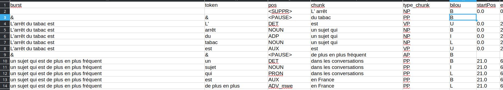
        
    - Pour un chunk qui chevauche sur deux burst, le résultat d’une première version de test ne prend pas en compte le chevauchement, il case le chunk en question que sur les tokens à la fin du premier burst et pour le début du deuxième burst, il met les chunk suivant.
        
        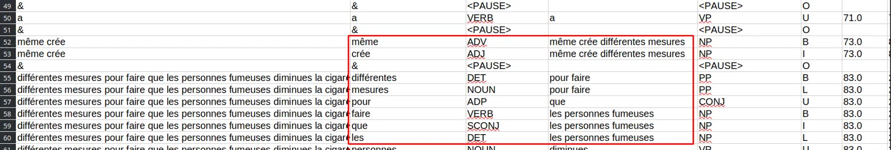
        
    - Après une correction, le deuxième test réussi à faire dépasser le chunk en question jusqu’au deuxième burst, sauf qu’il ne prend pas en compte des tokens auxquels il avait matcher au burst précédent et réinitialise le compteur qui compare le nombre de token du chunk au nombre de tokens dans le burst.
        
        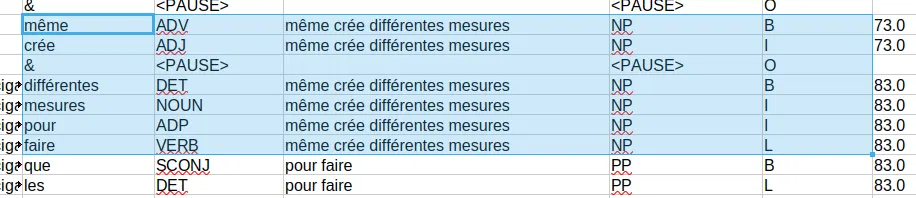
        
    - Ajout d’un autre compteur (offset) dans chaque tuple de chunk pour pouvoir compter le nombre de fois qu’il a été utilisé, ainsi le chunk ne déborde pas sur le prochain chunk quand il traite un chunk qui chevauche sur deux bursts.
    
    Résultat final :
        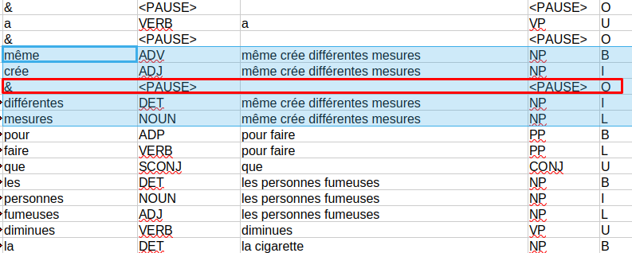

### Idée de correction postagger
- Sachant que `postagging` est une liste des pos du burst complet, nous pouvons créer une liste qui range toutes les pos du burst de stanza sans correction et le ranger sous un autre nom dans le dictionnaire et dans une nouvelle colonne (pos_stanza)
- Modifier `METADATA` en ajoutant le nom de la nouvelle colonne et en modifiant celui de l’ancienne si besoin
- Modifier la clé qui garde les pos des autres fonctions qui traitent pos (chunker, filter, read_write)
- Vérifier la sortie

## Corriger postagger et chunker (30/06)
Plan détaillé postag
-
- Modifier le script pour qu’il y ait deux colonnes/clés pour les POS, un qui range ceux de stanza et l’autres ceux après correction

Plan de correction chunk
-
- Ranger tous les groupes verbeaux avec leurs modifieurs ou autre dans VP = 1 chunk
    - Ajouter un test pour voir s’il y a la négation à l’intérieur du chunk, si oui, dans la colonne négation (nouvelle colonne à créer) mettre 1, sinon 0.
- Nommer les restes, c’est-à-dire, ceux dont nous ne pouvons étiqueter avec les étiquettes syntaxiques conventionnelles, pour UNKNOW (cette catégories ranges les LAS, X…)

## Corriger postagger et chunker 2 (01/07)
- Renommer la colonne `pos` par `pos_correction` et ajouter une colonne `pos_stanza` pour pouvoir connaître les correction apporté au POS.
- Correction de décalage en raison des lignes vides (id_4193 et id_4195)
- Correction des décalages dü aux expressions figées qui n’ont pas été reconnu en raison des espaces en trop entre (ex: “En␣␣effet”)
- Correction des biais (POS)
    - ou → où    18/370 → changer
        - id_1217, id_2811, id_5173, id_7085, id_7416, id_9503, id_13233, id_13251, id_13985, id_15879, id_18992, id_18996, id_19095, id_19214, id_20679, id_24274, id_24600 
        - ou → au      1/370 → UNKNOWN
            - id_4967
        - ou → ???    2/370 → UNKNOWN
            - id_20207
        - où → ou      3/58 → changer
            - id_6 = CCONJ
            - id_13609 = CCONJ
            - id_22655 = CCONJ
        - es → est     5/149 → corriger pour est
            - id_1443 = VERB/AUX
            - id_4237 = VERB/AUX mais le prochain burst est “t” une forme de reprise, est-ce qu’il y a besoin de corriger le POS ?
            - id_4259 = VERB/AUX
            - id_6517 =VERB/AUX
            - id_10534 ⇒ les prochains bursts sont des correction, donc pas besoin de corriger
        - es → LAS   90%  → tout mettre pour UNKNOW
           <br> es → et       1/149 → UNKNOWN
            - id_3451
- Ajout d’un colonne `negation` pour marquer l’existance d’une négation dans un chunk VP ou non

A vérifier :
- Corrigé, pos_stanza et pos_correction n’était pas rempli

Pour demain :

- Corriger le problème des biais dans le postagging
- Vérifier et corriger le problème des négations dans chunking

## Correction biais et négation (02/07)
- Correction des biais : changer les conditions de test de correction du numéro id (clé json) par des tuples de paires (ID, n_burst).
- Correction de la négation dans le chunk, quand un chunk VP contient la négation, il se repère d’un 1 dans la colonne `négation` sinon 0.
- Quelques modifications apporté dans le chunk VP, pour différencier les adverbes de degrès aux adverbes de négation (ex: plus)

## Correction et analyse (03/07)
Correction 
-
* Décalage en raison d'une expression figée qui se trouve dans deux burst à la suite
* Correction faute de frappe : unknow -> unknown
* Rédaction de la documentation des codes

Analyse : correction du code
- 
Correction du script :

- Par rapport au nombre de burst total, dans ceux calculés, il manque près de la moitié des burst. Après vérification, lors de l’ajout des tag <PAUSE>, la colonne `charge` n’a pas été précisé, de ce fait, pour ces lignes, les cellules sont vide (NAN), or pendant le chargement des données pour le calcul des analyses, nous avons besoin de regrouper selon plusieurs colonnes dont `charge`. Ce blanc provoque donc un regroupement de tous les <PAUSE> en un seul, c’est pour cela qu’il manquait près de la moitié des données dans nos résultats.
- Toujours avec le tag <PAUSE>, après la correction avec `charge` (ajout de données dans le prétraitement pour ce tag), le script d’analyse considère chaque <PAUSE> comme un burst à part entière. Ce problème vient du fait que nous regroupement par `n_burst`, cependant, pour ne pas perdre ces données lors d’un regroupement (`pd.groupby()`) au niveau du prétraitement (pos ou/et chunk) nous avons volontairement ajouté 0.50 sur la base du burst précédent (un réel burst enregistré au moment du processus d’écriture en temps réel).
De plus, un autre problème survient avec ce tag. Dans la partie qui répond à notre troisième approche (`[4/7]`), nous remarquons que le tag <PAUSE> n’apparaît qu’une fois dans le tableau de correspondance/non correpondance définit par les type de chunk. Or, nous savons que chaque <PAUSE> correspond bien à une séparation de burst, ainsi ce résultat est faussé. Cet erreur vient aussi d’un problème de regroupement, car pour ce tag, la colonne `chunk` est vide, ce qui fait que pandas compte toutes ces lignes pour un seul.
 Pour contourner ces problèmes, sans avoir a corriger dans le prétraitement, dans `charger_donnee()`, nous avons retirer les bursts séparateurs (<PAUSE>) avant les analyses et dans `construire_table_chunks()` nous dédupliquons correctement les lignes vides (NaN) dans la colonne chunk via la colonne `startPos`.
- Quand nous comparons le compte des tags <SUPPR> et <SPACE> du résultats avec celui du fichier CSV après traitement, nous remarquons que dans nos résultats, le nombre est inférieur à ce que nous avons réellement dans le fichier CSV. Après plusieurs tests de vérification, nous observons que la déduplication seulement par la colonne `startPos` n’était pas suffisante, car il existe des lignes dons ces données sont identiques sans être le même tag ou encore du même ID. Pour cela, sur la base de la correction précédente, nous ajoutons la condition `ID` en plus de `startPos` pour la déduplication. Avec cet ajout, nous sommes sur que même si un même `startPos` est repris, ils ont des `ID` unique.

## Réunion 6 (06/07)
- Enlever “que” (ADV) de NP
- “là (ADVP) ou (ADVP) celle (NP) des autres (PP) commencent (VP)”
- revoir VP et ADV
- Analyse par type de burst (P/R/RB)
- Connaître la configuration des chunks (si VP+NP …) à faire par rapport au type de chunk dans les bursts
- Pour les chunks multi
    - calculer le % globale : avec/sans correspondance parfaite (car il y a P)
    - prendre les chunks et voir le % de burst qui sont des **polichunk** ou **monochunk** ( voir si c’est avec plusieurs chunk )
    - pour savoir le nombre de chunk non cassé, car dans l’approche actuelle on sait juste qu’il y a des burst avec correspondance mais il existe des cas où il y a à l’intérieur des chunk non cassé mais qui ne sont pas comptabilisé

## Rédaction (07/07)
Rédaction du journal de bord : récapitulatif des informations de la réunion dernière et des problèmes/corrections apportés lors des semaines dernières.

## Rédaction 2 (08/07)
Mise au propre du `journal.md` sur github jusqu'à la semaine du 15/06. Ajout d'image et de lien plus parlant.

## Aménagement github (09/07-10/07)
* Suppression de certains correctifs et mise en ligne sur la branche main de github
* Réorganisation des commits de la branche test pour à la suite avoir une branche main propre et lisible.
* Suppression de fichiers et codes inutiles dans le dépôt local (sauvegarde en ligne -- journal de bord)

## Reprise chunker (13/07)
* Vérification des règles de la syntaxe chunk via les documents envoyés par Mme Taravella
* Extraire les syntaxes problèmatiques du résultat précédent (fichier csv).

## README.md (27/08)
Fin de rédaction du manuel d'utilisation dans README.md sur la branche main.

## Journal de bord (28-31/08)
Rédaction de la suite de journal.md sur la branche doc.

## Correction des règles du chunking (01-04/09)
* Mise en ligne du brouillon avec les corrections apportées sur les chunks (non daté).
    <br> [Voir le PDF](Journal_manuscrit.pdf)
- Le décalage des colonnes à partir de la ligne 1700 est du à la séparation csv par cette ponctuation “;”. à la ligne 1708, cette ponctuation est utilisé mais est reconnu par `to_csv` comme un séparateur.
- F+S13, np.int64(51)  : tout est reconnu comme PRON or il devrait être ADV et former avec “de même” un ADV_mwe, cependant, l’expression est coupé sur deux bursts, ainsi la reconnaissance a échoué.
    - Correction manuel pour que tout soit bien annoté
- “est-ce” pour qu’il soit compté en VP : ajout d’une condition dans `postagging` et mettre une précision pour pas attraper les autres `nsubj` comme “il, elle…” dans les pronoms.

## Correction et rédaction (05/09)
- Dernière correction dans le chunker
- Rédaction des conventions
    - [Convention détaillée](convention_detaille.md) avec la raison des choix faites
    - [Convention synthétique](convention_chunk.md) avec un exemple par règle
- Mise en ligne du journal manuscrite (correction sur les règles chunks -- 01-04/09)
- Ajout d'un [User manuel](user_man.md), qui reprend le README.md de la branche main dans la branche doc.